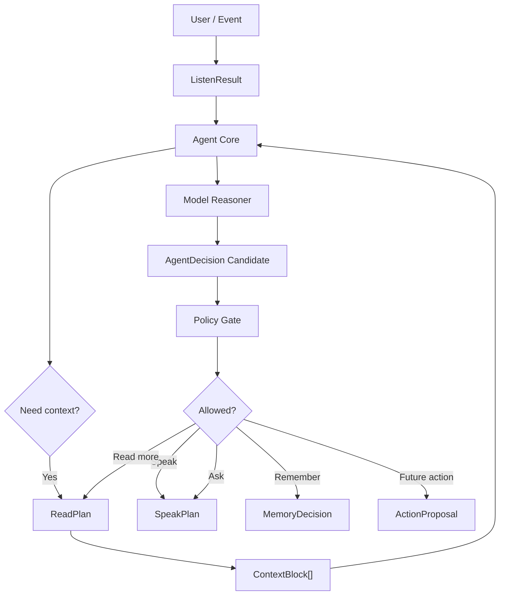
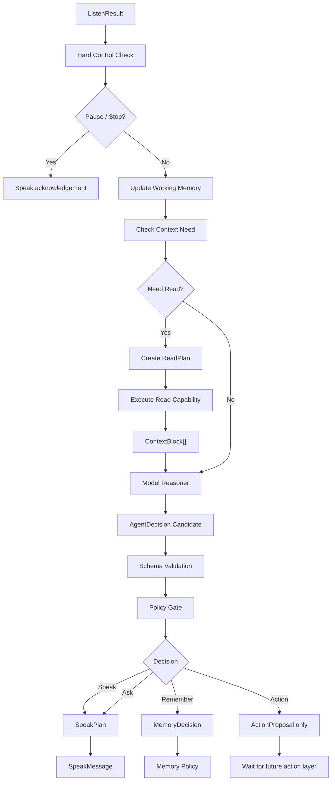

# Agent Core 设计：DAX Agent 的最小大脑

最后更新：2026-06-17

这份文档设计 DAX Agent 的“最小大脑”，也就是 Agent Core。当前只做设计，不实现运行时，也不设计四肢的具体动作能力。

在“小孩模型”里，眼睛让 DAX Agent 看见，耳朵让 DAX Agent 听懂，嘴巴让 DAX Agent 表达。大脑要做的事情不是替代这些能力，而是在它们之间做判断、调度、记忆选择、安全边界和学习反思。

一句话：

```text
大脑 = 在听、读、说、记忆、Skill 和行动之间做判断、计划、调度和自我校验的 Agent Core。
```

## 当前边界

这份文档只设计“最小大脑”。

不设计：

- 具体怎么写文件。
- 具体怎么执行命令。
- 具体怎么操作应用。
- 具体怎么发送邮件或 IM。
- 完整 MCP Client Manager。
- 完整 Skill Runtime。
- 完整长期记忆数据库或向量搜索。
- 多 Agent 协作。

但大脑必须为这些未来能力预留位置。因为四肢一旦接入，就会改变外部世界；如果没有大脑统一判断，四肢就容易变成“听到就动”。

## 核心结论

大脑不应该全靠硬编码规则，也不应该完全交给模型。

设计结论：

```text
模型负责思考。
代码负责骨架、边界、调度、验证和审计。
记忆负责保存和召回。
Skill 负责可复用习惯。
Policy 负责安全边界。
```

因此 DAX Agent 的大脑不是一个模型调用，而是：

```text
Agent Core
= deterministic controller
+ model reasoner
+ working memory
+ memory policy
+ skill router
+ capability router
+ safety policy
+ audit trail
```

低等级模型可以承担第一版大脑的日常思考任务，但它必须输出结构化结果，并且结果要经过代码校验。高级模型未来可以作为复杂任务升级路径，而不是第一版必需依赖。

## 为什么不能全用模型

模型很适合思考，但不适合独自掌管全部边界。

模型适合：

- 理解自然语言深层意义。
- 比较多个解决方案。
- 生成计划。
- 判断哪些上下文有价值。
- 总结学习到的内容。
- 判断是否值得沉淀记忆。
- 从 Skill 候选中选择可能有用的技能。
- 生成 `AgentDecision` 候选。

模型不适合单独负责：

- 是否真的写入文件。
- 是否真的执行命令。
- 是否真的发送外部消息。
- 是否真的保存长期记忆。
- 是否越过权限边界。
- 是否需要用户审批。
- 是否符合 schema。
- 是否记录 audit。
- stop / pause / continue 等硬控制信号。
- 敏感内容脱敏。

所以模型是大脑里的“思考区域”，不是整颗大脑。

## 为什么不能全用规则

规则很适合边界，但不适合理解复杂自然语言和开放任务。

纯规则会遇到这些问题：

- 用户表达模糊时很难理解真实目标。
- 很难生成高质量方案。
- 很难从经验中抽象出可复用知识。
- 很难判断一段资料对当前任务是否重要。
- 很难在复杂上下文中做权衡。
- 维护成本会随场景快速爆炸。

所以规则是骨架和反射，不是全部智能。

## 大脑在小孩模型中的位置

```text
耳朵 Listen        -> 输入信号意味着什么
眼睛 Read          -> 为了目标需要看什么
嘴巴 Speak         -> 如何表达判断、问题、计划和结果
海马体 Memory      -> 保存经历、知识、偏好和技能
Skill              -> 被消化后的做事方法
手脚 Actions       -> 未来改变世界的动作能力
大脑 Agent Core    -> 在这些能力之间做判断和调度
```

流程关系：



## 最小大脑的职责

### 1. 工作记忆

工作记忆保存当前任务的临时状态。

它不是长期记忆，而是当前这一轮或当前任务的桌面。

包含：

- 当前用户目标。
- 最近 `ListenResult`。
- 当前硬约束。
- 已读 `ContextBlock[]`。
- 未解决的问题。
- 当前计划。
- 工具结果摘要。
- 已生成的 `SpeakPlan`。
- 等待用户确认的动作。

建议结构：

```ts
type WorkingMemory = {
  sessionId: string;
  currentGoal?: string;
  activeConstraints: ActiveConstraint[];
  listenResult?: ListenResult;
  contextBlocks: ContextBlock[];
  toolResults: ToolResultSummary[];
  openQuestions: string[];
  currentPlan?: AgentPlan;
  pendingActionProposals: ActionProposal[];
  lastDecision?: AgentDecision;
  updatedAt: string;
};
```

作用：

- 让大脑知道当前在做什么。
- 防止每次用户说“继续”都重新开始。
- 让读、说、未来执行之间有共享上下文。

### 2. 意义整合

耳朵已经输出 `ListenResult`，但大脑要进一步判断它对当前任务意味着什么。

例子：

```text
用户说：“好吧，就按这个来。”
```

耳朵可能听出：

- confirmation
- reference: 这个
- nextStep: agent_core

大脑要结合工作记忆判断：

- “这个”是不是指刚才的大脑设计方案。
- 用户是在批准写文档，还是只是认可观点。
- 是否需要先说一句确认。
- 是否需要更新项目记忆。

大脑不是重新替代听能力，而是把听力结果放进当前任务上下文里解释。

### 3. 注意力调度

注意力决定现在该看哪里、不看哪里。

读能力负责读取，大脑负责决定是否要读。

大脑要判断：

- 当前回答是否需要额外上下文。
- 需要读项目记忆还是 workspace。
- 需要读网页还是本地文档。
- 读取范围多大。
- 是否有敏感风险。
- 是否应该先问用户而不是读。

例子：

```text
用户说：“下一步是不是该设计大脑？”
```

大脑判断：

- 需要读取当前路线图和项目记忆。
- 不需要读源码。
- 不需要联网。
- 可以先基于当前项目文档讨论。

### 4. 模型思考器

模型思考器是大脑的语义推理部分。

它可以使用低等级模型，前提是：

- 输入受控。
- 输出结构化。
- 结果必须校验。
- 高风险动作不能由模型直接执行。
- 低置信度时要追问或降级。

建议输入：

```ts
type ModelReasoningInput = {
  goal: string;
  listenResult: ListenResult;
  workingMemory: WorkingMemorySnapshot;
  contextBlocks: ContextBlock[];
  availableCapabilities: CapabilitySummary[];
  availableSkills: SkillSummary[];
  policySummary: PolicySummary;
  requiredOutputSchema: "AgentDecision";
};
```

建议输出：

```ts
type ModelReasoningResult = {
  understanding: string;
  proposedGoal: string;
  reasoningSummary: string;
  decision: AgentDecisionCandidate;
  confidence: number;
  uncertainty: string[];
};
```

注意：

```text
模型输出的是候选决策，不是最终决策。
```

最终决策必须经过 schema 校验、Policy Gate 和 Agent Core 合并。

### 5. 决策生成

大脑的核心输出是 `AgentDecision`。

建议结构：

```ts
type AgentDecision = {
  id: string;
  sessionId: string;
  goal: string;
  understanding: string;
  decisionType:
    | "answer_directly"
    | "ask_user"
    | "read_context"
    | "speak"
    | "propose_action"
    | "wait_for_approval"
    | "store_memory"
    | "recall_skill"
    | "pause"
    | "stop";
  confidence: number;
  reasons: string[];
  readPlan?: ReadPlanDraft;
  speakPlan?: SpeakPlanDraft;
  memoryDecision?: MemoryDecision;
  skillDecision?: SkillDecision;
  actionProposal?: ActionProposal;
  riskFlags: string[];
  requiresUserConfirmation: boolean;
  createdAt: string;
};
```

第一阶段大脑可以输出这些决策：

- `answer_directly`：不需要读，不需要工具，直接让嘴巴回答。
- `ask_user`：信息不足，让嘴巴追问。
- `read_context`：需要眼睛读取上下文。
- `speak`：已有足够信息，可以生成 `SpeakPlan`。
- `store_memory`：建议记录记忆，但不直接写入。
- `recall_skill`：建议检索或加载 Skill。
- `propose_action`：未来四肢动作候选，不直接执行。
- `pause` / `stop`：硬控制信号。

### 6. 记忆策略

用户提到“大脑应该往存储方向思考”，这是对的，但存储不应该是无差别保存。

大脑要决定：

- 这条信息值得记住吗？
- 应该记到哪里？
- 保存原文还是摘要？
- 是临时工作记忆，还是长期记忆？
- 是否包含密钥或隐私？
- 是否需要用户确认？
- 是否可能成为 Skill？

建议结构：

```ts
type MemoryDecision = {
  action: "ignore" | "store_episode" | "store_semantic" | "store_project_memory" | "draft_skill";
  reason: string;
  contentSummary: string;
  sourceRefs: string[];
  sensitivity: "public" | "personal" | "sensitive";
  confidence: number;
  requiresUserConfirmation: boolean;
};
```

记忆类型：

- 工作记忆：当前任务临时状态。
- Episode Memory：一次完整任务经历。
- Semantic Memory：长期事实、偏好、约束。
- Procedural Memory：可复用 Skill。
- Project Memory：当前仓库文档中的长期项目记忆。

第一阶段不需要实现完整数据库，可以先继续使用 `docs/project-memory.md`、`docs/conversation-log.md`、`docs/decision-log.md`，未来再抽象 Memory Store。

### 7. Skill 召回

Skill 是孩子学会的做事方法。

大脑要在合适时机问：

- 有没有类似任务的 Skill？
- 这个 Skill 是否适用于当前目标？
- Skill 是否过期？
- Skill 需要哪些读能力？
- Skill 是否涉及写入或执行？
- Skill 需要用户确认吗？

建议结构：

```ts
type SkillDecision = {
  action: "skip" | "search" | "load" | "draft_new_skill";
  query?: string;
  selectedSkillIds: string[];
  reason: string;
  confidence: number;
};
```

第一阶段可以先只设计，不实现 Skill Index。大脑文档需要为它预留接口。

### 8. 能力路由

大脑要控制五官和四肢，但控制方式不是模型直接调用工具。

建议能力路由：

```ts
type CapabilityRoute =
  | { kind: "listen"; event: ListenEvent }
  | { kind: "read"; plan: ReadPlan }
  | { kind: "speak"; plan: SpeakPlan }
  | { kind: "memory"; decision: MemoryDecision }
  | { kind: "skill"; decision: SkillDecision }
  | { kind: "action_proposal"; proposal: ActionProposal };
```

当前阶段：

- 听：已经接入用户消息入口。
- 读：已经有 ReadPlan 和 read API。
- 说：已经有 SpeakPlan 和 speak API。
- 记忆：仍主要靠 docs 手动更新。
- Skill：尚未实现。
- 四肢：尚未实现。

因此最小大脑第一阶段应该只真正路由：

```text
ListenResult -> ReadPlan -> ContextBlock -> SpeakPlan
```

四肢先只输出 `ActionProposal`，不执行。

### 9. Policy Gate

Policy Gate 是大脑里的硬边界。

它不依赖模型。

它负责判断：

- 是否允许读。
- 是否允许说。
- 是否允许记。
- 是否允许进入未来动作。
- 是否需要用户确认。
- 是否必须暂停。
- 是否涉及敏感信息。
- 是否越权。

建议结构：

```ts
type PolicyGateResult = {
  allowed: boolean;
  finalDecisionType: AgentDecision["decisionType"];
  reasons: string[];
  riskFlags: string[];
  requiredApprovals: ApprovalRequirement[];
  sanitizedDecision?: AgentDecision;
};
```

硬规则例子：

```text
用户说暂停 -> 不继续执行新步骤。
用户说不要写代码 -> 不生成写入动作。
嘴巴生成外部消息 -> 只能是草稿。
没有用户确认 -> 不发送外部消息。
没有工具结果 -> 不声称工具已运行。
检测到密钥 -> 输出和记忆前脱敏。
```

### 10. 自我校验

大脑每轮结束时应该问：

- 用户目标是否完成？
- 是否还有未解决问题？
- 是否需要继续读？
- 是否需要追问？
- 是否需要记录记忆？
- 是否需要生成 Skill 草稿？
- 是否有风险未说明？

建议结构：

```ts
type ReflectionResult = {
  goalCompleted: boolean;
  openQuestions: string[];
  memoryCandidates: MemoryDecision[];
  skillCandidates: SkillDecision[];
  verificationNeeded: boolean;
  nextSuggestedStep?: string;
};
```

第一阶段可以只在设计里定义，不急着实现完整反思器。

## 大脑如何控制五官和四肢

大脑必须控制五官和四肢，但控制方式要分层。

### 耳朵

耳朵是输入层。大脑不直接读取原始用户文本，而是优先消费 `ListenResult`。

```text
User text -> ListenEvent -> ListenResult -> Agent Core
```

好处：

- 输入已经有 intent、constraint、correction、contextNeed。
- 暂停、继续、纠正等信号不会被模型忽略。
- 可审计。

### 眼睛

眼睛是上下文读取层。大脑生成 `ReadPlan`，眼睛执行读取。

```text
AgentDecision(read_context) -> ReadPlan -> ReadResult -> ContextBlock -> Agent Core
```

大脑不能假装已经读过东西。只有读能力返回 `ContextBlock` 后，大脑才能基于它思考。

### 嘴巴

嘴巴是表达层。大脑生成 `SpeakPlan`，嘴巴生成 `SpeakMessage`。

```text
AgentDecision(speak) -> SpeakPlan -> SpeakMessage
```

大脑不能把计划当执行，也不能让嘴巴声称没有发生的结果。

### 记忆

记忆是保存和召回层。大脑生成 `MemoryDecision`，Memory Policy 决定是否真的保存。

```text
ListenResult / ContextBlock / ToolResult -> MemoryDecision -> Memory Policy -> Store
```

不是所有内容都该保存。尤其是密钥、隐私原文、一次性噪声和未经验证的网页内容。

### Skill

Skill 是做事方法。大脑可以召回 Skill，但不能让 Skill 绕过 Policy。

```text
AgentDecision(recall_skill) -> Skill Index -> Skill -> Agent Plan -> Policy Gate
```

### 四肢

四肢是未来动作能力。包括写文件、执行命令、操作应用、发送消息、修改日历等。

初版大脑不直接控制真实四肢，只生成 `ActionProposal`。

```ts
type ActionProposal = {
  id: string;
  kind:
    | "write_file"
    | "run_command"
    | "send_message"
    | "operate_app"
    | "update_calendar"
    | "call_mcp_tool";
  goal: string;
  reason: string;
  expectedEffect: string;
  riskLevel: "L1" | "L2" | "L3";
  requiresApproval: boolean;
  proposedInput: unknown;
};
```

这样未来接入手脚时，大脑已经有统一动作候选格式。

## 最小大脑的标准流程



## 模型使用策略

第一版大脑应该支持低等级模型。

### 日常模型

用于：

- 普通目标理解。
- 简单计划。
- 总结上下文。
- 选择表达模式。
- 生成记忆候选。

要求：

- 输出 JSON。
- 受 schema 约束。
- 可失败重试。
- 低置信度时降级为追问。

### 强模型

未来可选，用于：

- 复杂架构设计。
- 长文档综合推理。
- 多方案权衡。
- 失败复盘。
- Skill 抽象。

强模型不是必需依赖。DAX Agent 应该能用普通模型完成日常循环。

### 本地模型

未来可选，用于：

- 私密任务。
- 离线推理。
- 低成本常驻判断。

本地模型能力不足时，大脑应该知道自己不确定，而不是硬编。

## 结构化输出约束

模型思考器必须输出结构化 JSON。

建议第一阶段 schema：

```ts
type AgentDecisionCandidate = {
  goal: string;
  understanding: string;
  decisionType:
    | "answer_directly"
    | "ask_user"
    | "read_context"
    | "speak"
    | "store_memory"
    | "recall_skill"
    | "propose_action";
  confidence: number;
  reasons: string[];
  neededReads: Array<{
    kind: ReadSource["kind"];
    target: string;
    purpose: string;
    required: boolean;
  }>;
  speak: {
    mode: SpeakMode;
    audience: SpeakAudience;
    detailLevel: "brief" | "normal" | "detailed";
  };
  memory: Array<{
    action: MemoryDecision["action"];
    summary: string;
    reason: string;
  }>;
  risks: string[];
  questions: string[];
};
```

校验规则：

- `confidence` 必须在 0 到 1。
- `decisionType` 必须是枚举。
- `neededReads` 必须能转成 `ReadSource`。
- `speak.mode` 必须能转成 `SpeakMode`。
- 高风险 action 只能进入 `ActionProposal`。
- 模型不能直接返回“已执行”。

## 硬控制信号

这些信号不应该交给模型自由判断。

### Pause

用户说暂停时：

- 停止当前推进。
- 不继续读新内容。
- 不生成新实现计划。
- 嘴巴只做简短确认。

### Stop

用户说停止时：

- 终止当前任务。
- 清理 pending 计划。
- 不继续执行。

### Scope Constraint

用户说“只讨论设计”时：

- 大脑不得生成实现动作。
- 可以生成设计文档或讨论方案。

### No External Send

任何外部消息：

- 嘴巴只能生成草稿。
- 真正发送必须等待未来发送能力和用户确认。

### No False Completion

没有工具结果或验证记录：

- 不能说测试通过。
- 不能说已经提交。
- 不能说已经发送。

## 记忆存储方向

大脑确实应该往“存储学习到的内容”方向发展，但要分层。

### 存什么

应该保存：

- 用户长期偏好。
- 项目硬约束。
- 架构决策。
- 成功任务的关键步骤。
- 失败原因和修正方法。
- 经过验证的可复用流程。
- Skill 草稿。

不应该保存：

- 密钥。
- 凭证。
- 原始私密聊天。
- 大段无价值中间输出。
- 未验证网页内容。
- 一次性噪声。

### 怎么存

第一阶段：

- `docs/project-memory.md`
- `docs/conversation-log.md`
- `docs/decision-log.md`
- `docs/*-implementation.md`

未来阶段：

- Episode Store。
- Semantic Memory Store。
- Skill Store。
- Vector Index。
- Memory Review UI。

### 谁决定存

模型可以建议存，但代码和 Memory Policy 决定是否保存。

```text
ModelReasoner -> MemoryDecision candidate
MemoryPolicy -> accept / reject / ask user / summarize / redact
Store -> write
Audit -> record
```

## 失败和降级

大脑必须允许自己失败。

### 模型失败

如果模型不可用：

- 使用规则判断简单场景。
- 能回答的直接回答。
- 需要复杂思考时说明模型不可用。
- 不执行高风险动作。

### JSON 解析失败

如果模型输出不是合法 JSON：

- 尝试一次修复。
- 仍失败则降级为 `ask_user` 或 `answer_directly`。
- 写入 audit。

### 置信度低

如果 confidence 低：

- 优先追问。
- 或只做低风险读。
- 不进入写入、发送、执行。

### Policy 拒绝

如果 Policy Gate 拒绝：

- 嘴巴解释原因。
- 提供安全替代方案。
- 不偷偷绕过。

## 审计

大脑的每次关键判断都应该可复盘。

建议记录：

- 输入的 `ListenResult`。
- 是否触发读取。
- 使用了哪些 `ContextBlock`。
- 模型思考器输出摘要。
- 最终 `AgentDecision`。
- Policy Gate 结果。
- 生成的 `SpeakPlan`。
- MemoryDecision。
- ActionProposal。

不要记录：

- 模型完整隐藏推理。
- 密钥。
- 私密原文。
- 无必要的大段上下文。

## 第一阶段设计边界

第一阶段只设计最小大脑，不实现完整运行时。

后续实现时，第一阶段可以做：

- `AgentDecision` 类型。
- `WorkingMemory` 类型。
- `MemoryDecision` 类型。
- `SkillDecision` 类型。
- `ActionProposal` 类型。
- `PolicyGateResult` 类型。
- `AgentCoreInput` / `AgentCoreResult` 类型。
- `createAgentDecision()` 规则兜底。
- `reasonWithModel()` 模型思考器接口。
- `validateAgentDecision()` schema 校验。
- `applyPolicyGate()` 硬边界校验。
- 将 `processUserMessage()` 改成 `ListenResult -> Agent Core -> Read/Speak`。

暂不实现：

- 真正写文件动作。
- 真正执行命令动作。
- 真正发送消息动作。
- 完整 Skill Index。
- 完整 Episode Store。
- 完整向量记忆。
- 多模型自动路由。

## 未来实现顺序

建议顺序：

1. 完成 `docs/agent-core-design.md`。
2. 新增 `AgentDecision`、`WorkingMemory`、`MemoryDecision`、`SkillDecision`、`ActionProposal` 类型。
3. 新增 `src/lib/core.ts`，实现最小 Agent Core 骨架。
4. 先用规则实现 hard control、schema validation 和 Policy Gate。
5. 接入低等级模型作为 `ModelReasoner`，要求输出结构化 JSON。
6. 让 Agent Core 根据 `ListenResult` 触发 `ReadPlan`。
7. 把 `ContextBlock[]` 注入 Agent Core。
8. 让 Agent Core 生成 `SpeakPlan`。
9. 把 `processUserMessage()` 改成完整链路：Listen -> Core -> Read -> Core -> Speak。
10. 增加 `AgentDecision` audit。
11. 设计 Memory Policy 第一版。
12. 之后再设计四肢的具体动作能力。

## 设计原则

- 大脑是调度中枢，不是单纯模型。
- 模型负责思考，代码负责边界。
- 低等级模型可以做第一版日常思考。
- 模型输出只能是候选决策。
- 高风险动作不能由模型直接执行。
- 五官四肢都要通过 Agent Core 路由。
- 听到暂停就暂停。
- 没有读过就不能假装读过。
- 没有工具结果就不能假装执行过。
- 草稿不是发送。
- 记忆不是无差别保存。
- Skill 是方法，不是工具。
- Policy Gate 不依赖模型。
- 每次关键判断都应该可审计。

## 小结

最小大脑不是为了让 DAX Agent 一下子变得全能，而是为了让它开始有中枢。

它应该能做到：

- 听懂以后不立刻乱动。
- 需要上下文时知道让眼睛去看。
- 信息足够时知道让嘴巴怎么说。
- 值得记住时生成记忆候选。
- 可能有 Skill 时尝试召回。
- 未来需要四肢时先生成动作候选。
- 高风险时等待确认。

这样 DAX Agent 就不是“用户一句话 -> 模型一句话”，而是逐渐变成：

```text
听见 -> 理解 -> 看见 -> 思考 -> 记住 -> 说出 -> 未来再行动
```

这就是第一版大脑应该承担的责任。
