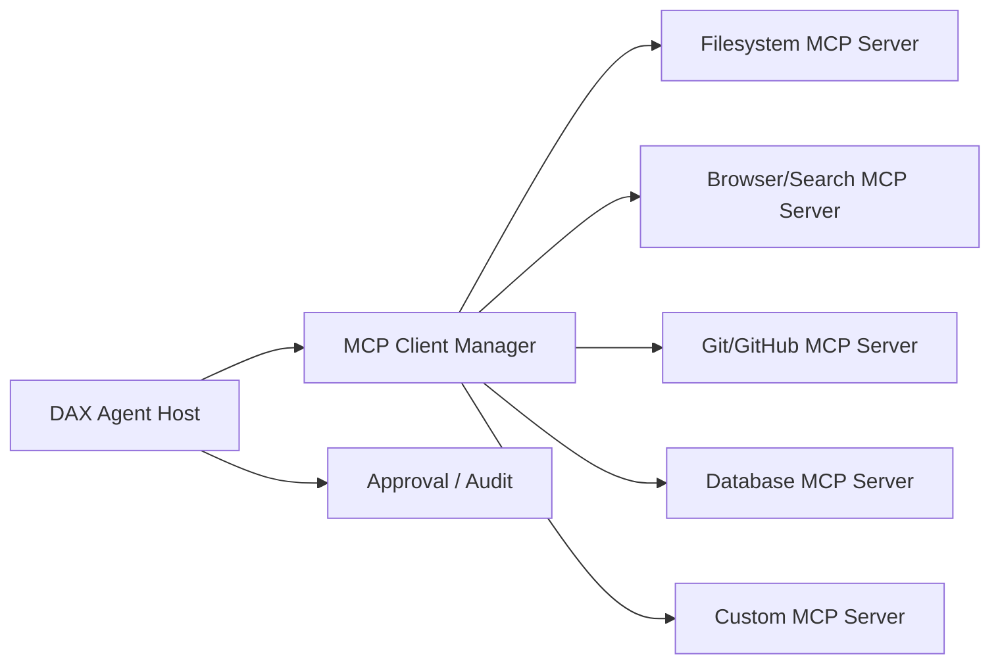
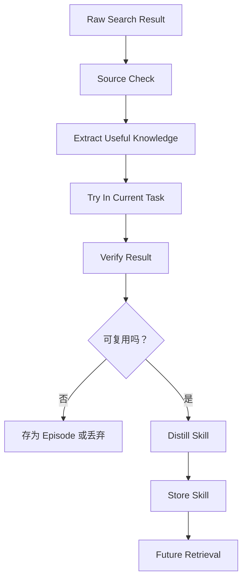
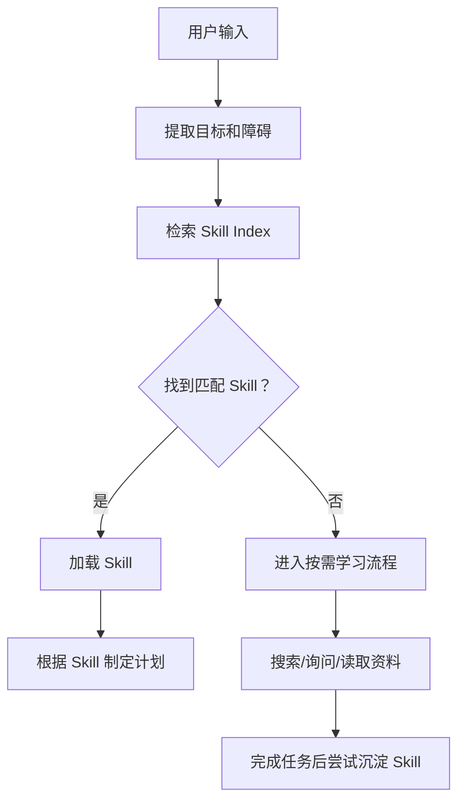

# Agent 学习模型：像孩子一样按需长出 Skill

最后更新：2026-06-16

这份文档记录 DAX Agent 的长期设计方向：它不应该只是一个装了很多工具的聊天框，而应该逐步成为一个会通过真实需求学习、沉淀、复用能力的本地 Agent。

当前阶段只做设计沉淀，不急着实现运行时。这个“小孩”不急着出生。

## 核心比喻

当电脑装上 DAX Agent，它像一个刚出生的小孩。

这个小孩不是一开始就全知全能，而是有：

- 感官：通过 MCP 读取外部世界。
- 手脚：通过 MCP 调用工具执行动作。
- 海马体：通过本地磁盘保存经历、资料和技能。
- 父母和老师：通过搜索、文档、用户反馈获得外部知识。
- 成长日记：通过 audit、session、episode 记录做过什么。
- 行为边界：通过 permission、approval、sandbox 保持安全。

对应关系：

```text
DAX Agent              = 小孩的大脑 / 自我
电脑磁盘 / workspace     = 海马体式记忆空间
MCP                    = 感官和手脚
Search / Web / Docs    = 父母、老师、书本、外部环境
Skill                  = 被消化后的做事方法
Session                = 当前经历
Episode                = 一次完整经历的记忆
Audit                  = 成长日记
Permission / Approval  = 行为边界
```

这个比喻的重点是：DAX Agent 不应该预先学习一切，也不应该无目的地在网络上乱搜。它应该在遇到具体目标和障碍时学习。

## 按需学习

核心循环：

```text
Need -> Search -> Try -> Verify -> Distill -> Store -> Retrieve -> Adapt
```

中文理解：

```text
需要产生问题
问题触发搜索
搜索带来材料
材料经过尝试
尝试产生经验
经验沉淀为 Skill
Skill 在相似场景中被唤醒
唤醒后根据新场景调整
```

曲奇盒子的例子：

```text
目标：想吃曲奇
障碍：打不开盒子
求助：问父母 / 搜索 / 看说明
观察：盒子有盖子、卡扣、旋钮、封条
尝试：从低风险动作开始
验证：盒子是否打开
沉淀：形成“打开未知容器”的 Skill
迁移：下次打不开糖果盒时唤醒这个 Skill
```

DAX Agent 中的例子：

```text
第一次：用户说“帮我接 Telegram”
Agent 没有现成 Skill
-> 搜索 Telegram Bot 文档
-> 读取当前项目结构
-> 实现并验证
-> 总结成 Skill：添加一个聊天 Channel Adapter

第二次：用户说“帮我接 Discord”
Agent 唤醒 Channel Adapter Skill
-> 复用通用步骤
-> 只搜索 Discord 特有部分
-> 更快完成
```

## 什么是 MCP

在这个模型里，MCP 是 DAX Agent 接触世界的标准接口。

MCP 负责回答：

- Agent 能看到什么？
- Agent 能读取什么？
- Agent 能调用什么动作？
- 这些能力来自哪里？
- 调用这些能力时要不要审批？

MCP 的重要对象：

- `tools`：可执行动作，比如读文件、查数据库、发请求、创建 issue。
- `resources`：只读上下文，比如文件、日志、schema、文档、日历。
- `prompts`：可复用提示模板或工作流入口。
- `roots`：Host 告诉 MCP Server 当前允许关注的文件系统边界。
- `elicitation`：MCP Server 需要补充信息时，通过 Host 向用户请求结构化输入。
- `sampling`：MCP Server 请求 Host 使用模型完成一段推理，但模型和权限仍由 Host 控制。

在 DAX Agent 里，MCP 应该先被设计为能力接入层：



MCP 不应该裸奔。所有 MCP 能力都必须被 Skill、权限和审计包住。

## 什么是 Skill

Skill 不是工具。Skill 是做事的方法。

MCP 提供“能做什么”，Skill 规定“怎么做才像一个可靠的人”。

例如 GitHub MCP Server 可能提供：

```text
github.create_issue
github.list_pull_requests
github.comment_on_pr
```

但 GitHub Issue Skill 应该规定：

```text
什么时候应该创建 issue？
创建前是否要搜索重复 issue？
标题如何命名？
body 应该包含哪些字段？
什么时候必须请求用户确认？
创建后如何总结？
```

因此 DAX Agent 的基本公式是：

```text
MCP 提供能力
Skill 约束行为
Agent 负责选择、编排和反思
```

## 记忆类型

DAX Agent 不能把所有搜索结果都当成 Skill。需要区分不同记忆层次。

### Raw Memory

原始资料。

例子：

- 搜索结果。
- 网页内容。
- 官方文档片段。
- API 示例。
- 本地文件原文。

特点：

- 未消化。
- 可信度不一定高。
- 可能过期。
- 不能直接当作行动规则。

### Episodic Memory

经历记忆。

例子：

- “2026-06-16，我们讨论了小孩模型。”
- “上次接入 Telegram 时，Webhook 配置踩过一个坑。”
- “某次运行测试失败，原因是 Node 版本不对。”

特点：

- 有时间、上下文、结果。
- 帮助 Agent 回忆过去发生过什么。
- 适合做复盘。

### Semantic Memory

语义知识。

例子：

- “MCP 有 tools/resources/prompts。”
- “只读资源和可执行工具应该分开。”
- “Node.js 目标版本是 >=20。”

特点：

- 比 episode 更抽象。
- 是事实、概念、约束。
- 需要来源和更新时间。

### Procedural Memory

程序性记忆，也就是 Skill。

例子：

- “如何分析一个项目。”
- “如何添加一个新 Channel Adapter。”
- “如何实现一个 MCP Client。”
- “如何做变更前风险评估。”

特点：

- 可复用。
- 有触发条件。
- 有步骤。
- 有输入输出。
- 有安全边界。
- 应该可以被验证、更新和废弃。

真正让 DAX Agent 越用越强的是 Procedural Memory。

## 什么时候搜索

DAX Agent 不应该一直在网络上搜索，也不应该把搜索当成默认动作。

搜索只在这些情况触发：

- 当前目标明确，但没有可用 Skill。
- 有 Skill，但 Skill 过期、置信度低或缺少关键步骤。
- 用户明确要求查最新资料。
- 任务涉及外部系统、库版本、协议、法律、价格、新闻等容易变化的信息。
- 工具执行失败，需要查找错误原因。
- 用户给出一个新概念、新系统或新 API。

不应该搜索的情况：

- 只需要使用已有项目上下文。
- 只需要解释已有代码或已有设计。
- 没有明确目标，只是为了“多学点东西”。
- 搜索结果无法验证，也无法转化为当前任务行动。

## 搜索结果如何变成 Skill

搜索结果不能直接进 Skill。

必须经过这条流水线：



一条信息要成为 Skill，至少需要满足：

- 来源可信，最好是官方文档、项目源码、实际验证结果或用户确认。
- 不是一次性的偶然答案。
- 能抽象成未来可复用的步骤。
- 有明确触发条件。
- 有适用边界。
- 有风险等级。
- 有验证方式。

## Skill 文件形态

未来 Skill 可以用文件存储。建议结构：

```text
skills/
  channel-adapter/
    SKILL.md
    examples/
    references/
  mcp-client/
    SKILL.md
    references/
  project-analysis/
    SKILL.md
```

一个 Skill 至少包含：

```yaml
name: channel-adapter
title: 添加一个聊天 Channel Adapter
version: 0.1.0
created_at: 2026-06-16
updated_at: 2026-06-16
triggers:
  - 用户要求接入新的聊天入口
  - 用户要求接入 Telegram/Discord/Slack/微信等
risk_level: L2
allowed_mcp:
  - filesystem
  - search
  - git
requires_approval:
  - 修改配置
  - 启动外部 webhook
  - 发送真实消息
verification:
  - 本地服务能启动
  - 测试消息能进入 Session
  - Audit 中有接收和回复记录
```

`SKILL.md` 应该写清楚：

- 这个 Skill 解决什么问题。
- 什么时候触发。
- 什么时候不要触发。
- 需要哪些 MCP capability。
- 标准步骤。
- 风险点。
- 验证方式。
- 成功后如何总结。
- 失败时如何降级。

## Skill 召回

当用户输入自然语言后，Agent 不应该立刻调用工具。

应该先进行 Skill 召回：



Skill 召回应考虑：

- 目标相似度。
- 动词相似度，例如“接入”“修复”“整理”“分析”。
- 对象相似度，例如 Telegram、Discord 都属于 Channel。
- 历史成功率。
- 最近更新时间。
- 当前项目上下文。
- 风险等级。

## MCP 与 Skill 的边界

边界必须清楚：

```text
MCP Server 不决定任务怎么做。
MCP Server 只暴露能力。

Skill 不直接执行动作。
Skill 规定方法和边界。

Agent Core 负责选择 Skill、调用 MCP、处理审批、记录结果。
```

错误设计：

```text
用户说一句话
-> 模型看到一堆 MCP tools
-> 模型随便挑工具执行
```

正确设计：

```text
用户说一句话
-> Agent 判断目标
-> 召回 Skill
-> Skill 限定可用 MCP 能力
-> Agent 生成计划
-> 低风险动作自动执行
-> 高风险动作请求审批
-> 执行后写入 Episode/Audit
-> 有价值经验沉淀为 Skill
```

## 安全原则

这个“小孩”不能因为能学习就到处乱碰。

安全原则：

- 默认不主动联网搜索，除非任务需要。
- 默认不执行高风险工具，除非用户审批。
- 默认不把网络资料直接当成事实。
- 默认不保存密钥、token、隐私凭证。
- 默认不把一次性网页内容沉淀成长期 Skill。
- Skill 必须有来源、版本和更新时间。
- Skill 必须有适用边界和风险等级。
- Skill 可以被更新，也可以被废弃。

## 遗忘与更新

Skill 不是越多越好。

DAX Agent 需要遗忘机制：

- 长期不用的 Skill 降低优先级。
- 多次失败的 Skill 进入 review 状态。
- 依赖过期 API 的 Skill 标记 stale。
- 用户否定过的 Skill 进入 blocked 或 deprecated。
- 新经验可以生成新版本，但不能静默覆盖旧行为。

Skill 状态建议：

```text
draft       草稿，尚未验证
verified    已在真实任务中验证
stale       可能过期，需要复查
deprecated  不再推荐
blocked     用户禁止使用
```

## 第一阶段设计目标

当前不急着实现完整系统。

第一阶段只做这些设计落地：

1. 定义 DAX Agent 的学习模型。
2. 定义 MCP 与 Skill 的分层边界。
3. 定义记忆类型。
4. 定义什么时候搜索。
5. 定义搜索结果如何沉淀 Skill。
6. 定义 Skill 文件格式草案。
7. 定义未来代码实现顺序。

## 未来实现顺序

建议顺序：

1. `Skill Index`：先让项目能枚举本地 Skill 文件。
2. `Skill Loader`：根据任务加载相关 Skill。
3. `Agent Decision`：自然语言先转成结构化决策。
4. `MCP Client Manager`：连接外部 MCP Server。
5. `Resource Context`：把 MCP resources 作为上下文输入。
6. `Tool Approval`：把 MCP tools 映射到现有 toolRuns 审批系统。
7. `Episode Store`：记录一次任务完整经历。
8. `Skill Distiller`：把成功经验整理成 draft Skill。
9. `Skill Review UI`：用户批准后，draft Skill 才能成为 verified。

## 参考资料

- [MCP Introduction](https://modelcontextprotocol.io/docs/getting-started/intro)
- [MCP Architecture](https://modelcontextprotocol.io/docs/learn/architecture)
- [Understanding MCP servers](https://modelcontextprotocol.io/docs/learn/server-concepts)
- [Understanding MCP clients](https://modelcontextprotocol.io/docs/learn/client-concepts)
- [Build with Agent Skills](https://modelcontextprotocol.io/docs/develop/build-with-agent-skills)
