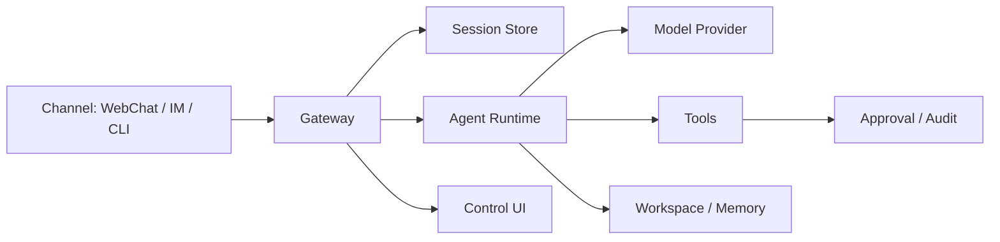
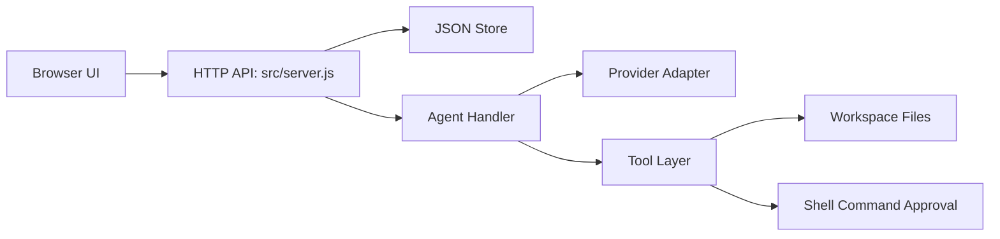
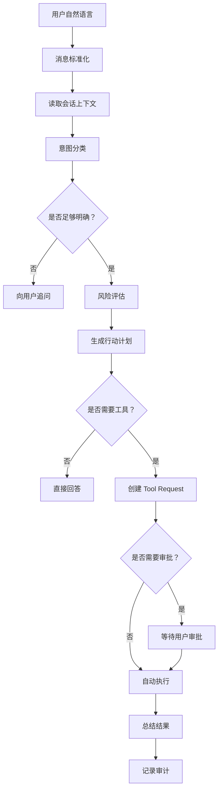

# 设计笔记

最后更新：2026-06-16

## OpenClaw 启发的核心理解

OpenClaw 最重要的设计理念是：它不是“一个聊天页面”，而是一个 Gateway。

Gateway 负责协调：

- Incoming Channels：WebChat、IM、CLI 等入口。
- Session State：会话和消息状态。
- Agent Routing：把请求交给哪个 Agent 或 Runtime。
- Tool Permissions：工具权限和审批。
- Model Provider Config：模型提供商配置。
- Control UI：人类可见、可操作的控制界面。
- Audit Records：审计记录。

模型 Provider 是可替换依赖。Channel 是可替换输入。Tool 是可替换能力。真正的核心是 Gateway。

## 概念架构

## 当前 MVP 架构

## 为什么第一版先做 Local-First

第一版刻意避开外部依赖和外部 Channel，是为了先看清楚核心链路：

- 用户消息进入 Session。
- Agent 判断是直接回答还是请求工具。
- 工具请求变成可见记录。
- 危险动作等待用户审批。
- 执行结果被保存，并写入 Audit Trail。

这个基础比一开始接很多聊天平台更重要。Channel 可以以后加，但 Gateway 的行为规则必须先清楚。

## 安全模型

当前安全模型基于“可见”和“限制权限”：

- 服务默认只监听 `127.0.0.1`。
- Workspace 工具会把路径限制在当前项目工作区内。
- 只读工具可以自动执行。
- Shell 命令会创建 pending tool run，等待用户审批。
- 工具创建、审批、拒绝、执行都会写入 audit records。

这仍然只是基础安全模型。未来需要继续加入：

- 用户身份。
- 权限 Profile。
- 命令策略。
- Sandbox。
- 更严格的 Tool Schema。
- 更清晰的危险操作二次确认。

## 自然语言操作协议

下一个重大设计主题是：Agent 收到普通自然语言后，应该按照什么流程行动。

建议流程：

建议操作类型：

- `answer_only`：只回答，不调用工具。
- `clarify`：信息不足，需要追问。
- `workspace_read`：列目录、搜索文件、读取文件。
- `workspace_write`：创建或修改文件。
- `shell_command`：运行命令、测试、启动本地服务。
- `external_call`：调用外部服务、访问外部账号、发送消息。
- `long_task`：多步骤任务，需要计划和阶段性反馈。
- `automation`：定时、监控、提醒、周期任务。

建议风险等级：

- `L0`：没有本地动作，直接回答。
- `L1`：只读 workspace 访问，可以自动执行但要记录。
- `L2`：文件编辑、测试、本地服务启动，执行前应该展示计划。
- `L3`：破坏性操作、任意 shell、外部账号、安装依赖，必须明确审批。

这套协议以后应该同时成为文档和代码，而不只是口头约定。

## MCP 与 Skill 的长期方向

2026-06-16 形成新的长期设计方向：DAX Agent 应该围绕 MCP 和 Skill 两条主线成长。

- MCP 是能力接口层，负责让 Agent 连接外部系统、读取 resources、调用 tools、使用 prompts。
- Skill 是行为方法论层，负责规定 Agent 什么时候用能力、如何用能力、如何验证结果、如何沉淀经验。
- Agent Core 是调度层，负责理解用户目标、召回 Skill、选择 MCP 能力、请求审批、执行并记录。

详细设计见 `docs/agent-learning-model.md`。
