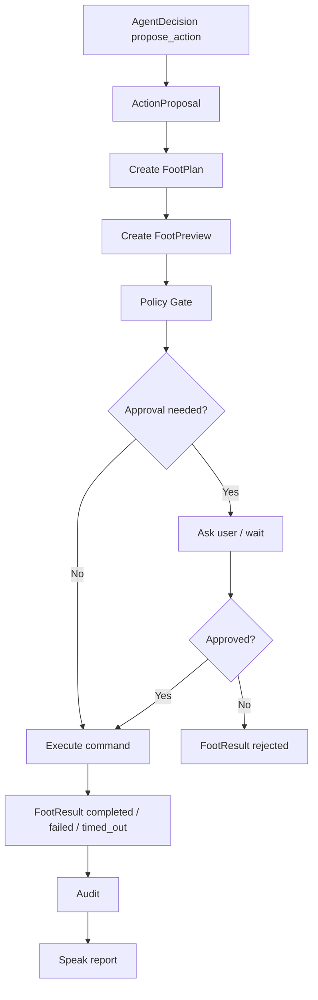

# 脚能力设计：DAX Agent 的第一类执行器

最后更新：2026-06-17

这份文档设计 DAX Agent 的“脚”能力，也就是这个孩子第一次真正开始“走动”和“运行过程”的能力。

在“小孩模型”里，眼睛负责看，耳朵负责听，嘴巴负责表达，大脑负责判断和调度，手负责修改对象。脚和手不一样：手改变对象本身，脚启动过程、运行命令、跑测试、构建项目、打开服务、等待结果。

一句话：

```text
脚 = 在受控边界内启动、观察和结束本地执行过程的能力。
```

脚不是“修改文件”，也不是“发送消息”。脚真正管理的是过程：

- 运行一次命令。
- 跑一次测试。
- 执行一次 build。
- 启动一个本地服务。
- 停止一个已知进程。
- 观察 stdout、stderr、exit code、timeout 和持续时间。

第一阶段必须收窄：只做 workspace 内的前台命令执行，不做长期后台进程、不做 GUI、不做远程机器、不做定时任务、不做外部服务发布。

## 当前边界

第一阶段实现：

- workspace 内运行本地命令。
- 给命令生成 `FootPlan`。
- 给命令生成 `FootPreview`。
- 根据审批状态执行命令。
- 捕获 stdout、stderr、exit code、timeout 和 duration。
- 生成 `FootResult`。
- 写入 audit。
- 与现有 `shell.run` 工具兼容。

第一阶段暂不实现：

- 长期后台服务管理。
- 进程列表扫描和任意 kill。
- GUI 应用操作。
- 远程 SSH 执行。
- Docker/Kubernetes 编排。
- 定时任务。
- 外部系统发布。
- 自动网络任务。
- 命令输出流式推送。
- 交互式 stdin。

这些未来都可以属于脚，或者与脚协作，但第一阶段不要急。

## 脚和其他能力的边界

### 脚和手

手负责修改对象，脚负责运行过程。

例子：

```text
手：修改 src/lib/foot.ts。
脚：运行 TypeScript typecheck。
```

```text
手：写入 package.json。
脚：运行 npm install 或 npm run build。
```

运行命令可能间接修改文件，例如 build 生成 dist、npm install 修改 lockfile。脚不应该假装这些修改不存在，而是要打风险标记。未来手和脚可以协作：手预览可预测文件修改，脚运行会产生过程输出。

### 脚和嘴巴

嘴巴负责汇报执行结果，但不能代替脚。

正确关系：

```text
FootResult.status === "completed"
-> 嘴巴可以说“命令运行完成”
```

错误关系：

```text
模型生成了一个命令
-> 嘴巴说“我已经运行了”
```

嘴巴必须基于真实 `FootResult` 汇报执行行为。

### 脚和眼睛

眼睛读上下文，脚运行过程。

脚执行前经常需要眼睛先看：

- package.json 里有哪些脚本。
- 当前 workspace 是什么项目。
- 目标命令是否合理。
- 最近执行结果是什么。

但眼睛不运行命令，脚也不负责长期上下文过滤。

### 脚和大脑

大脑判断该不该运行，脚负责如何安全运行。

未来路径：

```text
AgentDecision
-> ActionProposal
-> FootPlan
-> FootPreview
-> PolicyGateResult
-> FootResult
-> Speak report
```

第一阶段大脑还没有接入，脚先作为独立 capability 和 API 跑通。

### 脚和 MCP

MCP 可能提供命令执行、浏览器自动化、远程环境、CI、部署等工具。它们不能绕过脚。

未来正确关系：

```text
MCP execution tool
-> Capability Registry 标记为 execute/process
-> Agent Core 生成 ActionProposal
-> Foot Capability 生成 preview / approval
-> 调用 MCP tool
-> FootResult / Audit
```

第一阶段不接 MCP execution tool。

## 脚能运行什么

第一阶段只支持本地 workspace 命令。

### Workspace Command

例子：

- `node --version`
- `npm run build`
- `npm run typecheck`
- `git status --short`
- `rg "keyword" docs`
- `node dist/server.js --help`

这类命令在 workspace 内运行，cwd 必须在 workspace 内。

### Test Command

例子：

- `npm test`
- `npm run typecheck`
- `node --test`
- `vitest run`

测试命令通常不应修改业务文件，但可能写 coverage、cache、snapshot。第一阶段应标记为中风险。

### Build Command

例子：

- `npm run build`
- `tsc -p tsconfig.server.json`

构建命令可能写入 `dist/`、`public/app.js` 等产物。第一阶段应标记为中风险。

### Long Running Service

例子：

- `npm run dev`
- `node dist/server.js`

第一阶段不做长期进程管理。命令如果明显像 dev server，应标记 `long_running`，并默认拒绝或要求更高审批。未来再设计服务句柄、健康检查、停止策略和日志截断。

### External Side Effect Command

例子：

- `git push`
- `npm publish`
- `curl -X POST ...`
- `ssh ...`
- `scp ...`
- `docker push`

第一阶段应标记高风险，默认不自动执行。

## 脚的分级

脚使用 F0-F3 分级。

### F0：不执行

只计划、解释、生成命令草稿或预览，不启动进程。

例子：

- 解释应该运行什么命令。
- 生成命令计划。
- 展示将要运行的 cwd、timeout 和风险。

### F1：低风险本地检查

短时间、只读倾向、不会修改外部系统的本地检查。

例子：

- `node --version`
- `git status --short`
- `tsc --version`
- `pwd`

第一阶段 DAX Agent 自身仍建议要求审批，因为脚会启动真实进程；但 F1 可以用于更温和的风险说明。

### F2：中风险本地执行

可能消耗资源、写 build 产物、跑测试、改变缓存或影响 workspace 状态的本地执行。

例子：

- `npm run build`
- `npm run typecheck`
- `npm test`
- `node scripts/generate.js`

F2 必须有 preview 和明确审批。

### F3：高风险执行

可能删除数据、修改依赖、影响外部系统、长期运行、触碰凭证或不可逆。

例子：

- `rm -rf ...`
- `git reset --hard`
- `git clean -fd`
- `npm install`
- `npm publish`
- `git push`
- `curl -X POST ...`
- `ssh ...`
- `docker system prune`
- `Remove-Item -Recurse`

F3 必须审批。第一阶段中，一些 F3 命令即使有审批也可以保守拒绝，直到对应策略成熟。

## 核心结构

### FootPlan

`FootPlan` 是执行前的结构化计划。

```ts
type FootPlan = {
  id: string;
  goal: string;
  reason: string;
  actions: FootAction[];
  riskLevel: "F0" | "F1" | "F2" | "F3";
  requiresPreview: boolean;
  requiresApproval: boolean;
  expectedOutcome: string;
  createdAt: string;
};
```

作用：

- 固定准备运行什么。
- 说明为什么运行。
- 说明风险多高。
- 说明是否需要审批。

### FootAction

`FootAction` 是一次具体执行动作。

```ts
type FootAction = {
  id: string;
  kind: "run_command" | "run_test" | "run_build" | "start_service" | "stop_process";
  targetKind: "workspace" | "package_script" | "system_process" | "external_service";
  command: string;
  cwd: string;
  reason: string;
  expectedEffect: string;
  inputSummary: string;
  timeoutMs?: number;
};
```

第一阶段只执行：

- `run_command`
- `run_test`
- `run_build`

第一阶段拒绝：

- `start_service`
- `stop_process`
- `external_service`

### FootPreview

`FootPreview` 是执行前给用户、大脑和审计系统看的预览。

```ts
type FootPreview = {
  id: string;
  planId: string;
  summary: string;
  commands: string[];
  actionPreviews: FootActionPreview[];
  riskLevel: "F0" | "F1" | "F2" | "F3";
  riskFlags: string[];
  requiresApproval: boolean;
  createdAt: string;
};
```

脚的 preview 不可能像手一样提供 diff。它应该展示：

- 将要运行的命令。
- cwd。
- timeout。
- 是否需要审批。
- 可能的副作用。
- 是否长期运行。
- 是否疑似网络、删除、发布、安装、重置或外部系统操作。

### FootResult

`FootResult` 是执行后的真实结果。

```ts
type FootResult = {
  id: string;
  planId: string;
  previewId?: string;
  status: "completed" | "rejected" | "failed" | "skipped" | "timed_out";
  commandResults: FootCommandResult[];
  output?: string;
  error?: string;
  auditId?: string;
  startedAt?: string;
  completedAt?: string;
  durationMs?: number;
  createdAt: string;
};
```

作用：

- 嘴巴汇报命令是否真的运行。
- 大脑判断下一步是否继续。
- 记忆系统沉淀一次执行经验。
- 审计系统复盘执行行为。

## 标准流程



## 审批策略

脚会启动真实进程，所以比读、听、说更危险。

第一阶段策略：

```text
F0：不审批，因为不执行。
F1：建议审批，因为仍会启动进程。
F2：必须审批。
F3：必须审批，部分高风险命令保守拒绝。
```

用户在当前 Codex 开发过程中可以授权 Codex 运行命令；但 DAX Agent 自身运行时应该更保守。第一阶段 API 用 `approved: true` 表示调用方已经完成审批。

## 风险标记

建议 `riskFlags`：

- `executes_process`
- `uses_shell`
- `workspace_command`
- `runs_test`
- `runs_build`
- `long_running`
- `writes_workspace`
- `modifies_dependencies`
- `network_command`
- `external_side_effect`
- `destructive_command`
- `uses_secrets`
- `requires_user_confirmation`
- `workspace_escape`
- `unsupported_action`
- `shell_disabled`
- `timeout_risk`

风险标记用于解释和审计，不应该只靠单个字符串阻断所有行为。最终是否执行由 Policy Gate 决定。

## 输出处理

脚必须记录命令输出，但不能无限记录。

第一阶段规则：

- 捕获 stdout 和 stderr。
- 捕获 exit code。
- 捕获是否 timeout。
- 捕获 duration。
- 输出过长时截断，并标记已截断。
- 不把凭证写入结果。
- 结果中保留足够信息让用户判断成功或失败。

未来可以增加流式输出和日志分页。

## 与现有 shell.run 的关系

当前项目已经有 `shell.run` 工具，且必须审批。脚能力不应该废掉它，而应该成为它背后的结构化执行层。

第一阶段建议：

```text
shell.run approved
-> FootPlan
-> FootPreview
-> FootResult
-> tool.completed / tool.failed
```

这样现有 UI 和工具审批继续可用，同时执行行为进入脚能力审计链。

## 第一阶段实现顺序

1. 新增 `docs/foot-capability-design.md`。
2. 在 `src/lib/types.ts` 增加 `FootPlan`、`FootAction`、`FootPreview`、`FootResult` 等类型。
3. 新增 `src/lib/foot.ts`，实现计划、预览、风险、执行和结果格式化。
4. 在 `src/lib/store.ts` 增加 foot 持久化和 audit。
5. 在 `src/server.ts` 增加 foot API：
   - `POST /api/foot/plan`
   - `POST /api/foot/preview`
   - `POST /api/foot/execute`
   - `GET /api/foot-plans`
   - `GET /api/foot-previews`
   - `GET /api/foot-results`
6. 让 `shell.run` 复用脚能力。
7. 新增 `docs/foot-capability-implementation.md`。
8. 更新项目记忆、路线图、决策日志和对话日志。
9. 验证 typecheck、build、核心执行和 HTTP API。
10. 提交代码。

## 方法文档要求

和读、听、说、手一样，脚能力代码必须清晰。

后续实现必须遵守：

- 每个 exported 方法都有 JSDoc。
- 涉及路径、安全、风险、执行、timeout、输出处理、结果格式化的内部 helper 也必须有 JSDoc。
- JSDoc 必须写“使用方法”和“作用”。
- 重要方法还要写“边界”。
- 不能让命令执行散落在 API、agent 或 tools 各处。
- 真正启动进程只能通过脚能力核心。

建议模板：

```ts
/**
 * 创建一次脚部执行计划。
 *
 * 使用方法：
 * - API 层或未来 Agent Core 收到命令执行请求后调用 createFootPlan(input)。
 * - 调用方需要提供 goal、reason 和 actions。
 * - 这个方法只创建计划，不启动进程。
 *
 * 作用：
 * - 把“准备运行什么、为什么运行、风险多高、是否需要审批”固定成结构化记录。
 * - 让 preview、policy gate、execute 和 audit 都基于同一份计划。
 *
 * 边界：
 * - 不运行命令。
 * - 不绕过审批。
 * - 不接受 workspace 外 cwd 作为可执行位置。
 */
```

## 小结

脚让 DAX Agent 不只是“看见”和“说出”，而是能真正启动过程并观察结果。

但脚必须慢一点长出来。第一阶段只做 workspace 内的前台命令执行，并坚持：

```text
FootPlan -> FootPreview -> FootResult
```

等这条链稳定后，再考虑长期进程、服务管理、远程执行、MCP execution tool 和自动化任务。
