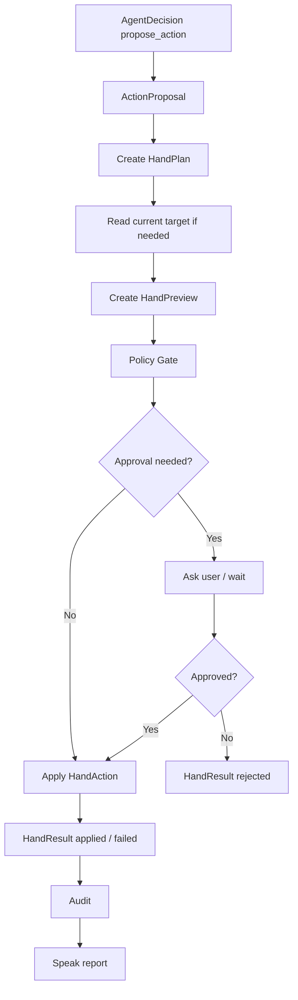

# 手能力设计：DAX Agent 的第一类行动器

最后更新：2026-06-17

这份文档设计 DAX Agent 的“手”能力，也就是这个孩子第一次真正开始改变世界的能力。当前只做设计，不实现运行时。

在“小孩模型”里，眼睛负责看，耳朵负责听，嘴巴负责表达，大脑负责判断和调度。手负责对对象进行可审计、可预览、可控制的修改。

一句话：

```text
手 = 对本地或外部对象进行可审计、可预览、可确认的修改能力。
```

手不是所有动作。运行命令、启动服务、跑测试更像“脚”；发送外部消息更像 Channel send；长期自动任务更像未来的任务系统。手的核心是“修改对象”。

## 当前边界

这份文档只设计“手”。

当前第一版重点只设计：

- workspace 文件创建。
- workspace 文件更新。
- patch 预览。
- patch 应用。
- 小范围文档或代码修改。
- 修改后的审计记录。

暂不设计：

- 真实删除大量文件。
- 真实移动大量文件。
- 修改数据库记录。
- 修改外部账号对象。
- 操作 GUI 应用。
- 发送邮件或 IM。
- 发布公开内容。
- 长期自动化任务。
- 完整 MCP tool 写入系统。

这些未来都可以属于“手”或与“手”协作，但第一版必须收窄。因为手一旦动起来，就会改变用户的电脑和外部系统。

## 核心判断

读默认可以逐次不问，因为读是观察。嘴巴默认可以表达，因为表达在本地聊天中没有外部副作用。手不同，手会修改对象。

设计结论：

```text
手不能默认全自动。
能预览的修改必须先预览。
高风险修改必须审批。
修改后必须可审计。
```

手的第一原则：

```text
动手前知道要改什么。
动手时只改承诺过的范围。
动手后能看到改了什么。
```

## 手和其他能力的边界

### 手和嘴巴

嘴巴负责表达，手负责写入。

例子：

```text
嘴巴：生成一份设计文档草稿。
手：把草稿写入 docs/hand-capability-design.md。
```

```text
嘴巴：生成邮件草稿内容。
手：未来可以创建邮件草稿对象。
Channel send：真正发送邮件。
```

嘴巴不能说“我已经写入文件”，除非手真的返回 `HandResult`。

### 手和脚

手修改对象，脚运行过程。

例子：

```text
手：修改 package.json。
脚：运行 npm install 或 npm run build。
```

```text
手：写入测试文件。
脚：运行测试。
```

这两个能力要分开，因为风险不同。写文件和运行命令都危险，但危险形态不一样。

### 手和眼睛

眼睛读上下文，手修改目标。

手在修改前经常需要眼睛先看：

- 目标文件是否存在。
- 当前内容是什么。
- 项目风格是什么。
- 是否有冲突。
- 是否有用户未提交变更。

手不能在没有看过目标内容的情况下盲改复杂文件。

### 手和大脑

大脑不直接写文件。大脑生成 `ActionProposal`，手把它转成 `HandPlan`。

标准关系：

```text
AgentDecision
-> ActionProposal
-> HandPlan
-> HandPreview
-> Approval / AutoPolicy
-> HandResult
```

大脑负责判断要不要动手，手负责如何安全修改。

### 手和 MCP

MCP tool 可能提供写入能力，但 MCP tool 不能绕过手。

正确方式：

```text
MCP write tool
-> Capability Registry 标记为 write/action
-> Agent Core 生成 ActionProposal
-> Hand Capability 生成 preview / approval
-> 调用 MCP tool
-> HandResult / Audit
```

错误方式：

```text
模型看到 MCP tool
-> 直接调用写入
```

## 手能修改什么

手最终可以覆盖很多对象，但第一版只真正关注 workspace。

### Workspace Files

本地项目文件。

例子：

- Markdown 文档。
- TypeScript 源码。
- JSON 配置。
- README。
- 测试文件。
- 样例数据。

第一版优先支持。

### Documents

用户指定的本地文档。

例子：

- 笔记。
- Markdown 文件。
- 导出的文本资料。
- 未来的 Word、Excel、PPT。

第一版只把它们当普通文件处理，未来再接文档解析和写回。

### Config

配置文件。

例子：

- `package.json`
- `tsconfig.json`
- `config/default.json`
- `config/local.json`
- `.env`

配置修改风险更高。尤其是 `.env`、`config/local.json` 可能包含密钥，必须更谨慎。

### External Objects

未来可能包括：

- GitHub issue。
- Pull request。
- Notion 页面。
- 日历事件。
- 邮件草稿。
- IM 草稿。
- 数据库记录。

第一版不实现，只定义未来边界。

### Application State

未来可能包括：

- 编辑器当前打开文件。
- 浏览器表单。
- 桌面应用内容。
- 剪贴板。
- 系统设置。

第一版不实现，因为 GUI 状态修改更难预览和回滚。

## 手的分级

手的分级用于决定预览、审批和审计强度。

### H0：不动手

只讨论、解释、计划、生成草稿，不修改任何对象。

例子：

- 讲设计。
- 生成一段可复制的代码。
- 写邮件草稿但不保存到外部系统。
- 只展示 patch 草案。

### H1：低风险修改

在 workspace 内做小范围、可理解、可 diff 的修改。

例子：

- 新增一个 Markdown 设计文档。
- 更新项目记忆。
- 修改 README 的文档索引。
- 新增小型源文件。
- 修正明显 typo。

条件：

- 目标在 workspace 内。
- 不删除文件。
- 不触碰密钥文件。
- 修改范围小。
- 可通过 diff 展示。
- 用户已经明确要求写入或实现。

H1 可以在明确用户请求下自动应用，但仍要记录 preview 和 result。

### H2：中风险修改

会影响代码行为、配置、多个文件或构建结果的修改。

例子：

- 修改源码逻辑。
- 修改 package 配置。
- 修改 tsconfig。
- 修改多个模块。
- 大段重写文档。
- 修改测试。

要求：

- 生成 diff preview。
- 说明影响范围。
- 记录风险标记。
- 修改后建议运行验证。
- 必要时请求用户确认。

H2 是否自动应用，取决于用户请求、当前模式和项目规则。Codex 当前开发工作通常可以在用户明确要求实现时应用 H2，但 DAX Agent 自身未来应更严格。

### H3：高风险修改

可能不可逆、影响隐私、影响外部系统、删除内容或大范围改变状态。

例子：

- 删除文件。
- 移动大量文件。
- 修改 `.env`。
- 修改密钥配置。
- 改数据库记录。
- 改外部账号内容。
- 创建或更新公开对象。
- 批量重写大量文件。
- 修改用户私密文档。

要求：

- 必须用户确认。
- 必须说明不可逆风险。
- 必须记录 audit。
- 尽量提供备份或回滚方案。
- 不允许模型绕过。

## 手的核心结构

### HandPlan

`HandPlan` 是动手前的结构化计划。

```ts
type HandPlan = {
  id: string;
  goal: string;
  reason: string;
  targetKind:
    | "workspace_file"
    | "document"
    | "config"
    | "external_object"
    | "application_state";
  actions: HandAction[];
  riskLevel: "H0" | "H1" | "H2" | "H3";
  requiresPreview: boolean;
  requiresApproval: boolean;
  expectedOutcome: string;
  createdAt: string;
};
```

作用：

- 让大脑知道手准备改什么。
- 让用户和审计系统知道修改范围。
- 让 Policy Gate 判断是否允许继续。

### HandAction

`HandAction` 是计划中的单个修改动作。

```ts
type HandAction = {
  id: string;
  kind:
    | "create_file"
    | "update_file"
    | "delete_file"
    | "move_file"
    | "apply_patch"
    | "create_external_draft"
    | "update_external_object";
  target: string;
  reason: string;
  expectedChange: string;
  inputSummary: string;
};
```

第一版建议只实现：

- `create_file`
- `update_file`
- `apply_patch`

`delete_file`、`move_file` 先设计，后续再实现。

### HandPreview

`HandPreview` 是动手前给大脑、用户和审计系统看的预览。

```ts
type HandPreview = {
  id: string;
  planId: string;
  summary: string;
  affectedTargets: string[];
  diff?: string;
  reversible: boolean;
  riskFlags: string[];
  createdAt: string;
};
```

要求：

- 文件修改必须尽量有 diff。
- 没有 diff 的修改要说明原因。
- H2/H3 必须有清晰 summary。
- H3 必须说明是否可回滚。

### HandResult

`HandResult` 是动手后的结果。

```ts
type HandResult = {
  id: string;
  planId: string;
  previewId?: string;
  status: "applied" | "rejected" | "failed" | "skipped";
  changedTargets: string[];
  diffApplied?: string;
  error?: string;
  auditId?: string;
  createdAt: string;
};
```

作用：

- 嘴巴汇报时必须引用真实 `HandResult`。
- 大脑反思时根据它判断是否完成目标。
- 记忆系统可以用它沉淀 Episode。

## 标准流程



## 手和审批

审批不是为了拖慢，而是为了防止不可逆修改。

默认策略：

```text
H0：不审批，因为不修改。
H1：用户明确要求时可自动应用，但要记录 preview/result。
H2：通常需要 preview；是否审批取决于用户授权和项目模式。
H3：必须审批。
```

对 DAX Agent 自身未来运行时，建议比 Codex 当前工作流更谨慎：

- 写代码：H2，至少有 diff preview。
- 删除文件：H3，必须确认。
- 修改密钥配置：H3，必须确认。
- 修改外部系统：H3，必须确认。
- 创建本地文档：H1，可以自动。

## 手和 diff

diff 是手的核心安全机制。

手应该优先使用 patch，而不是直接覆盖文件。

好处：

- 用户能看见变化。
- 大脑能复盘变化。
- 审计能记录变化。
- 失败时更容易定位。
- 未来可以支持回滚。

第一版 workspace 写入策略：

```text
读取旧内容
生成新内容
计算 diff
生成 preview
根据 policy 应用
记录 result
```

如果是新文件，也应该生成类似 diff：

```diff
--- /dev/null
+++ docs/example.md
@@
+# Example
+...
```

## 手和用户未提交变更

手必须尊重用户已有修改。

规则：

- 不要覆盖用户未提交修改。
- 修改前尽量读取目标文件当前内容。
- patch 应基于当前内容应用。
- 如果 patch 冲突，停止并汇报。
- 不要用 reset、checkout 等方式回滚用户改动。

对 git workspace：

- 手可以读取 git status。
- 手可以把 dirty state 当风险标记。
- 手不能静默清理工作区。

## 手的风险标记

建议 `riskFlags`：

- `modifies_workspace`
- `creates_file`
- `updates_file`
- `deletes_file`
- `moves_file`
- `modifies_config`
- `touches_secret_like_file`
- `large_change`
- `multi_file_change`
- `external_object`
- `private_user_data`
- `irreversible_change`
- `requires_user_confirmation`
- `dirty_worktree`
- `patch_conflict`
- `no_preview_available`

风险标记不一定阻止修改，但会影响审批和汇报。

## 手和记忆

手的结果很适合进入 Episode Memory。

应该记录：

- 为什么修改。
- 改了哪些文件。
- diff 摘要。
- 是否验证。
- 是否失败。
- 用户是否确认。

不应该记录：

- 密钥原文。
- 私密文档全文。
- 无必要的大段 diff。

如果一次手部操作形成可复用流程，可以成为 Skill 候选。

例子：

```text
Skill: 新增一个能力设计文档并更新项目记忆
触发：用户要求设计新能力
步骤：读当前记忆 -> 写设计文档 -> 更新 roadmap/project-memory/decision-log/conversation-log -> 验证 diff
```

## 手和 Skill

Skill 不直接写文件。Skill 规定怎么写，手执行修改。

Skill 可以声明：

```yaml
required_hand:
  allowed_actions:
    - create_file
    - update_file
  requires_preview: true
  forbidden_targets:
    - .env
    - config/local.json
```

大脑加载 Skill 后，仍要通过 HandPlan 和 Policy Gate。

## 手和 MCP

未来 MCP tool 可能提供：

- filesystem.write_file
- filesystem.apply_patch
- github.update_issue
- notion.update_page
- calendar.update_event

DAX Agent 不应该把这些 tool 直接暴露给模型。

建议映射：

```text
MCP write tool -> HandAction adapter
MCP delete tool -> H3 HandAction
MCP external update -> H3 HandAction
MCP draft creation -> H2/H3 depending on target
```

所有 MCP 写入动作都要：

- 标记风险。
- 生成 preview 或说明无法 preview。
- 经过 Policy Gate。
- 写入 audit。

## 第一阶段设计边界

第一阶段只设计手，不实现完整运行时。

后续实现第一阶段可以做：

- `HandPlan` 类型。
- `HandAction` 类型。
- `HandPreview` 类型。
- `HandResult` 类型。
- workspace 文件写入 adapter。
- patch preview。
- patch apply。
- hand audit。
- hand API：
  - `POST /api/hand/plan`
  - `POST /api/hand/preview`
  - `POST /api/hand/apply`
  - `GET /api/hand-results`
- 让 Agent Core 只生成 `ActionProposal`，再由手转换成 `HandPlan`。

暂不实现：

- 删除文件。
- 移动大量文件。
- 修改外部对象。
- 操作 GUI 应用。
- 修改数据库。
- 发送消息。
- 长期自动化。

## 未来实现顺序

建议顺序：

1. 完成 `docs/hand-capability-design.md`。
2. 新增 `HandPlan`、`HandAction`、`HandPreview`、`HandResult` 类型。
3. 新增 `src/lib/hand.ts`，实现 workspace patch preview。
4. 实现 workspace patch apply。
5. 新增 hand 持久化和 audit。
6. 新增 hand API。
7. 让 Agent Core 的 `ActionProposal` 能转成 `HandPlan`。
8. 在嘴巴汇报里引用真实 `HandResult`。
9. 增加 H2/H3 审批策略。
10. 再设计“脚/执行能力”。
11. 之后再设计外部对象修改和 MCP write tool adapter。

## 设计原则

- 手是修改，不是表达。
- 手是修改，不是运行。
- 手不能绕过大脑。
- 手不能绕过 Policy Gate。
- 手修改前应尽量预览。
- 手修改后必须记录结果。
- H3 必须审批。
- 删除和外部修改必须非常谨慎。
- patch 优先于覆盖。
- 不覆盖用户未提交改动。
- 不修改密钥文件，除非用户明确确认。
- 嘴巴不能声称手已完成，除非有 `HandResult`。
- Skill 不能直接动手，只能指导手。

## 小结

手让 DAX Agent 第一次真正开始改变世界。

所以手的设计不能只问“能不能写文件”，而要问：

- 为什么要改。
- 改哪里。
- 怎么预览。
- 风险多高。
- 要不要确认。
- 改完怎么证明。
- 失败怎么停止。
- 经验怎么沉淀。

第一版手先从 workspace 写入和 patch 开始，是最稳的路径。等手能可靠地创建、修改、预览和审计本地文件之后，再去设计脚、外部对象和更复杂的 MCP 写入能力。
