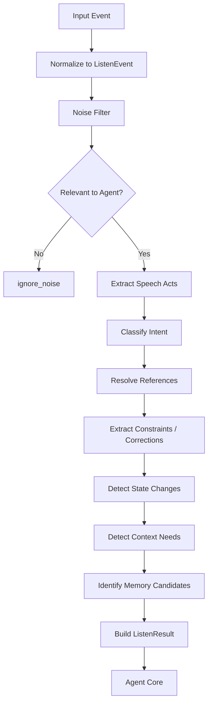

# 听能力设计：DAX Agent 的第二类感官

最后更新：2026-06-17

这份文档专门设计 DAX Agent 的“听”能力，也就是这个孩子的“耳朵”。当前只讨论耳朵，不设计嘴巴、手、脚、写入、执行、发送消息或自动化动作。

在“小孩模型”里，眼睛负责看世界里的资料，耳朵负责接收用户和环境发出的信号。听不是简单的自然语言理解，也不是语音转文字。听的核心是：把输入信号转成 Agent 可以理解的目标、约束、纠正、状态变化和上下文需求。

一句话：

```text
听 = 接收信号，并判断它对 Agent 意味着什么。
```

## 当前边界

这份文档只设计“听”。

不设计：

- 如何回答用户。
- 如何写文件。
- 如何执行命令。
- 如何发送消息。
- 如何操作应用。
- 如何自动化长期任务。
- 如何沉淀完整 Skill Runtime。

但听能力必须为这些未来能力提供清晰输入。耳朵听到的结果可以告诉 Agent Core：“用户在提问”“用户在纠正边界”“用户要求暂停”“用户要求实现”“当前缺少上下文，需要触发 ReadPlan”。它本身不执行这些动作。

## 听和读的关系

眼睛和耳朵是两种不同感官。

```text
听：接收用户、系统、应用、MCP 或任务状态发出的信号。
读：在明确目标下读取文件、网页、配置、应用内容、记忆或 MCP resource。
```

例子：

```text
用户说：“帮我看看这个项目下一步怎么做。”
```

耳朵需要听出：

- 用户正在请求建议。
- “这个项目”指当前 workspace。
- “下一步”依赖已有项目状态。
- 需要先读项目记忆、路线图和当前代码状态。

然后耳朵输出结构化结果，Agent Core 再决定生成 ReadPlan，让眼睛去看。

耳朵不是眼睛，耳朵不能自己假装已经看过文件。耳朵只能说：“我判断这里需要看这些东西。”

## 为什么听很重要

听能力重要，是因为它决定 Agent 对用户输入的第一反应。听错了，后面读得再准、工具再强，也会跑偏。

关键价值：

- 理解用户当前目标。
- 识别暂停、继续、停止、只讨论、不写代码等控制信号。
- 区分提问、设计、实现、提交、学习解释、纠正、闲聊。
- 理解“这个”“刚才那个”“下一步”“按这个方案”等上下文指代。
- 提取用户设定的边界和偏好。
- 判断是否缺上下文，是否应该触发 ReadPlan。
- 过滤噪声、误触和与 Agent 无关的事件。
- 把多入口输入统一成一种内部事件格式。
- 记录重要输入和决策，但避免无意义地保存全部原文。

## 听什么

耳朵不只听自然语言。它听的是输入事件。

### 用户文本

来自聊天框、命令框、移动端消息、浏览器侧边栏、IDE 面板等。

例子：

- “继续。”
- “先暂停。”
- “把代码提交一下。”
- “我们现在只讨论读。”
- “我需要学习一下这个设计。”
- “不对，我说的是 MCP，不是 map。”

用途：

- 识别用户目标。
- 识别控制信号。
- 识别纠正。
- 识别长期偏好。
- 识别是否需要读取上下文。

### 语音转写

来自麦克风或语音输入后的文字结果。

注意：耳朵第一阶段不设计常驻麦克风。语音输入必须来自明确接入的通道，例如用户主动点击说话后生成的 transcript。

用途：

- 让用户用口语表达任务。
- 识别更自然的暂停、继续、纠正和补充。
- 处理口语中的重复、断句和不完整表达。

### UI 控制事件

来自界面按钮、快捷键、菜单、拖拽或选择动作。

例子：

- 用户点击“暂停”。
- 用户点击“继续”。
- 用户点击“提交”。
- 用户切换会话。
- 用户在界面中选择一段文本并发送给 Agent。

用途：

- 把非语言输入也统一成 ListenEvent。
- 避免所有能力都依赖聊天文本。

### Channel 事件

Channel 是信号进入 DAX Agent 的入口，Listen 是理解这些信号的层。

例子：

- WebChat 消息。
- 浏览器插件消息。
- IDE 插件消息。
- 手机端消息。
- CLI 输入。
- 未来的外部聊天平台消息。

用途：

- 统一多入口消息。
- 保留来源、会话、用户、时间、语言、可信度。

### MCP 通知事件

来自 MCP Server 的只读通知或资源变化。

例子：

- `notifications/resources/list_changed`
- 某个 resource 更新。
- 某个只读工具返回状态。
- 外部系统告诉 Agent 有新内容可读。

用途：

- 告诉 Agent 某些资源发生了变化。
- 触发后续是否需要 ReadPlan 的判断。

注意：MCP 通知被听见，不代表立刻读取或执行。它只是一个输入信号。

### 工具结果事件

来自内部工具或未来能力的完成、失败、超时结果。

例子：

- typecheck 完成。
- build 失败。
- read API 返回结果。
- shell 工具被拒绝。
- Git 提交成功。

用途：

- 让 Agent 继续当前任务。
- 识别失败后是否需要补读日志。
- 识别是否该向用户汇报。

### 应用状态事件

来自已经接入的应用或插件。

例子：

- 当前浏览器标签页变化。
- 当前编辑器打开文件变化。
- 当前选中文本变化。
- 当前终端出现错误输出。

用途：

- 给 Agent 提供当前工作现场的信号。
- 判断用户可能正在处理什么。

注意：应用状态事件通常带隐私风险。听见不等于保存，更不等于自动读取全部内容。

### 时间和任务事件

来自定时器、提醒、后台任务或 heartbeat。

例子：

- 某个延迟任务到点。
- 某个周期检查触发。
- 上一次任务等待恢复。

用途：

- 唤醒 Agent 继续某个上下文。
- 让 Agent 知道“现在到了该继续听/处理的时候”。

## 听的输出

听能力的输出不是一句回答，而是结构化理解结果。

建议结构：

```ts
type ListenResult = {
  id: string;
  eventId: string;
  primaryIntent: ListenIntent;
  intents: ListenIntent[];
  speechActs: SpeechAct[];
  target?: string;
  references: ListenReference[];
  constraints: ListenConstraint[];
  corrections: ListenCorrection[];
  stateChanges: ListenStateChange[];
  contextNeeds: ListenContextNeed[];
  memoryCandidates: ListenMemoryCandidate[];
  riskFlags: string[];
  confidence: number;
  nextStep: ListenNextStep;
  createdAt: string;
};
```

其中最重要的是：

- `primaryIntent`：当前最主要意图。
- `constraints`：用户给出的边界。
- `corrections`：用户对 Agent 理解的修正。
- `stateChanges`：暂停、继续、切换阶段等状态变化。
- `contextNeeds`：是否需要眼睛去读。
- `nextStep`：建议下一步交给哪个能力处理。

## ListenEvent

所有输入先统一成 ListenEvent。

```ts
type ListenEvent = {
  id: string;
  kind: ListenEventKind;
  channelId: string;
  sessionId?: string;
  userId?: string;
  locale?: string;
  rawText?: string;
  payload?: Record<string, unknown>;
  sourceLabel: string;
  privacyLevel: "public" | "personal" | "sensitive";
  trust: "high" | "medium" | "low";
  capturedAt: string;
};
```

建议事件类型：

```ts
type ListenEventKind =
  | "user_text"
  | "user_voice_transcript"
  | "ui_control"
  | "channel_message"
  | "mcp_notification"
  | "tool_result"
  | "app_state"
  | "timer"
  | "system_event";
```

设计原则：

- 先统一入口，再理解含义。
- 保留来源和时间。
- 明确隐私级别。
- rawText 可以短期存在，但长期保存要经过过滤。
- payload 只能放结构化事件数据，不应该无限塞原始内容。

## Intent：意图

意图是用户或事件想让 Agent 进入的任务方向。

建议意图类型：

```ts
type ListenIntent =
  | "chat"
  | "ask"
  | "explain"
  | "design"
  | "implement"
  | "review"
  | "inspect"
  | "read"
  | "commit"
  | "push"
  | "configure"
  | "pause"
  | "continue"
  | "stop"
  | "correct"
  | "approve"
  | "reject"
  | "remember"
  | "forget"
  | "status"
  | "unknown";
```

注意：识别出 `commit`、`push`、`implement` 不代表耳朵会执行提交、推送或写代码。耳朵只负责告诉 Agent Core：“用户意图可能是这个。”

例子：

```text
“提交代码”
```

听的结果：

```json
{
  "primaryIntent": "commit",
  "constraints": [],
  "nextStep": "agent_core"
}
```

```text
“你现在写的都是什么，可以把所有的设计和我说一下吗”
```

听的结果：

```json
{
  "primaryIntent": "explain",
  "contextNeeds": [
    {
      "kind": "memory",
      "reason": "需要读取当前设计和项目状态"
    }
  ],
  "nextStep": "read_then_answer"
}
```

## Speech Act：话语动作

同一句话可能包含多个话语动作。意图是任务方向，话语动作是语言行为。

建议类型：

```ts
type SpeechAct =
  | "request"
  | "question"
  | "instruction"
  | "constraint"
  | "correction"
  | "confirmation"
  | "rejection"
  | "preference"
  | "status_request"
  | "brainstorm"
  | "casual";
```

例子：

```text
“不是只有读这个地方吗？不要设计别的先。”
```

包含：

- `question`
- `correction`
- `constraint`

耳朵必须识别出这里的重点不是问题本身，而是用户正在收窄边界。

## Constraint：约束

约束是听能力最重要的输出之一。

约束可能是短期的，也可能是长期的。

例子：

```text
“这个项目我将不会写一行代码，全程要你进行开发。”
```

这是长期偏好。

```text
“我们现在只讨论读这个地方。”
```

这是当前阶段约束。

```text
“不要用 Python 实现。”
```

这是技术栈约束。

建议结构：

```ts
type ListenConstraint = {
  kind:
    | "scope"
    | "permission"
    | "technology"
    | "style"
    | "language"
    | "pace"
    | "privacy"
    | "process";
  content: string;
  duration: "turn" | "session" | "project" | "permanent";
  strength: "soft" | "hard";
  sourceText?: string;
};
```

约束优先级：

```text
hard project/permanent > hard session > hard turn > soft project > soft session > soft turn
```

如果用户新约束和旧约束冲突，耳朵要把冲突标出来，让 Agent Core 决定是否需要确认。

## Correction：纠正

纠正是用户在教孩子。

例子：

- “不是 map，是 MCP。”
- “我没有提到嘴巴和手。”
- “我们讨论的不是只有读这个地方吗？”
- “我不想用 Python 实现。”
- “我已经切换到 Node 20 了。”

纠正比普通输入更重要，因为它会改变 Agent 对项目的长期理解。

建议结构：

```ts
type ListenCorrection = {
  wrong?: string;
  correct?: string;
  target:
    | "terminology"
    | "scope"
    | "assumption"
    | "implementation"
    | "memory"
    | "behavior";
  shouldUpdateMemory: boolean;
  sourceText: string;
};
```

纠正处理规则：

- 纠正术语：更新当前会话和项目记忆。
- 纠正边界：立即影响后续行为。
- 纠正技术栈：更新项目长期约束。
- 纠正事实：如果影响项目方向，要进入 project memory。
- 纠正语气或节奏：影响后续交互方式。

## Reference：指代

用户经常不会把目标说完整。

例子：

- “这个。”
- “刚才那个。”
- “下一步。”
- “按这个方案。”
- “在这个基础上。”
- “这一步走通了吗？”

耳朵必须解析这些指代。

建议结构：

```ts
type ListenReference = {
  text: string;
  resolvedTo?: string;
  confidence: number;
  needsRead: boolean;
};
```

解析顺序：

1. 当前用户消息中的显式对象。
2. 最近一轮 Agent 回复。
3. 当前任务阶段。
4. 当前项目记忆。
5. 当前 workspace 或打开的应用上下文。
6. 如果仍不确定，标记为 unresolved。

如果指代不清楚但风险低，可以做合理推断；如果会导致写入、执行、删除、推送等动作，必须让 Agent Core 再确认。

## State Change：状态变化

有些输入不是任务，而是改变 Agent 当前状态。

例子：

- “先暂停。”
- “继续。”
- “停。”
- “不要写代码。”
- “开始下一步。”
- “现在只讨论设计。”

建议结构：

```ts
type ListenStateChange = {
  kind:
    | "pause"
    | "resume"
    | "stop"
    | "scope_change"
    | "mode_change"
    | "priority_change";
  value: string;
  appliesTo: "current_turn" | "current_task" | "session" | "project";
};
```

状态变化优先级很高。

处理顺序：

```text
stop > pause > scope_change > correction > explicit task > casual chat
```

如果用户说“暂停”，Agent 不应该继续解释一大段设计。

如果用户说“继续”，Agent 要恢复上一个未完成的上下文，而不是重新开始。

## Context Need：上下文需求

听完以后，耳朵要判断是否缺上下文。

建议结构：

```ts
type ListenContextNeed = {
  kind:
    | "workspace"
    | "memory"
    | "document"
    | "web_page"
    | "computer_config"
    | "app_content"
    | "mcp_resource"
    | "none";
  reason: string;
  suggestedTarget?: string;
  required: boolean;
};
```

例子：

```text
“这一步走通了吗？”
```

耳朵判断：

- 需要读取最近验证记录或项目记忆。
- 可能需要看当前 git 状态。
- 如果问的是运行结果，还需要看上次工具输出。

```text
“讲讲听能力为什么重要。”
```

耳朵判断：

- 不一定需要读文件。
- 可以基于当前对话上下文回答。

```text
“根据文档，把代码写出来。”
```

耳朵判断：

- 需要读设计文档。
- 需要读代码结构。
- 之后 Agent Core 才能计划实现。

## Memory Candidate：记忆候选

用户说的某些内容应该被长期记录，但不是所有输入都该保存。

建议结构：

```ts
type ListenMemoryCandidate = {
  kind:
    | "user_preference"
    | "project_constraint"
    | "decision"
    | "terminology"
    | "correction"
    | "workflow";
  content: string;
  importance: "low" | "medium" | "high";
  suggestedStore: "none" | "conversation_log" | "project_memory" | "decision_log";
};
```

应该进入记忆的例子：

- 用户不会写代码，全程由 Codex 开发。
- 项目使用 TypeScript，不使用 Python。
- 当前只设计读，不设计其他能力。
- 读能力默认不逐次审批。
- 重要纠正和架构决策。

不应该长期保存的例子：

- 闲聊原文。
- 临时情绪表达。
- 无关片段。
- 密钥、凭证、完整私密聊天内容。
- 大段语音原始转写。

## NextStep：下一步建议

耳朵不执行任务，但要建议下一步交给谁。

建议类型：

```ts
type ListenNextStep =
  | "answer_directly"
  | "read_then_answer"
  | "plan"
  | "implement"
  | "ask_clarifying_question"
  | "pause"
  | "resume"
  | "record_memory"
  | "ignore_noise"
  | "agent_core";
```

例子：

```text
“继续”
```

```json
{
  "primaryIntent": "continue",
  "stateChanges": [
    {
      "kind": "resume",
      "value": "continue previous task",
      "appliesTo": "current_task"
    }
  ],
  "nextStep": "resume"
}
```

```text
“根据文档，把代码写出来”
```

```json
{
  "primaryIntent": "implement",
  "contextNeeds": [
    {
      "kind": "memory",
      "reason": "需要读取项目当前设计约束",
      "required": true
    },
    {
      "kind": "workspace",
      "reason": "需要读取代码结构和相关模块",
      "required": true
    }
  ],
  "nextStep": "read_then_answer"
}
```

## 标准流程



## 噪声过滤

不是所有听到的东西都该被处理。

噪声包括：

- 空输入。
- 重复输入。
- 和当前 Agent 无关的系统噪声。
- 不完整语音转写。
- 用户误触。
- 已经处理过的重复事件。
- 低可信 Channel 的无来源消息。

噪声过滤不能太激进。原则是：

```text
不确定但可能重要 -> 标记低置信度，交给 Agent Core。
明显无关或重复 -> ignore_noise。
```

## 置信度

听能力必须承认自己可能听错。

置信度来源：

- 用户表达是否明确。
- 是否有上下文可以解析指代。
- 是否和当前任务阶段一致。
- 是否存在冲突约束。
- Channel 是否可信。
- 语音转写是否完整。

建议：

```text
confidence >= 0.8：可以直接进入下一步。
0.5 <= confidence < 0.8：可以继续，但要保留不确定标记。
confidence < 0.5：优先问澄清问题，或只做低风险处理。
```

## 风险标记

听到的内容也有风险。

建议 `riskFlags`：

- `contains_secret_like_text`
- `private_user_data`
- `sensitive_instruction`
- `ambiguous_reference`
- `conflicting_constraints`
- `low_confidence_transcript`
- `external_channel`
- `background_event`
- `state_change`
- `memory_candidate`

风险标记不阻止听。它提醒后续处理要谨慎。

## 隐私和记录原则

耳朵要记住重要事情，但不能变成无差别录音机。

原则：

```text
听见不等于保存。
保存不等于保存原文。
重要的是保留可复盘的意图、约束和决策。
```

建议：

- 用户主动发送到聊天框的文本可以进入会话记录。
- 语音原始音频不默认保存。
- 语音转写可以短期用于理解，长期保存前要摘要。
- 敏感内容只保存必要摘要和风险标记。
- 项目长期规则进入 `project-memory.md`。
- 关键架构决策进入 `decision-log.md`。
- 普通对话只进入 `conversation-log.md` 的摘要。

## 听能力和 Channel 的关系

Channel 是输入在哪里发生，Listen 是输入意味着什么。

```text
Channel Adapter -> ListenEvent -> ListenResult -> Agent Core
```

Channel Adapter 负责：

- 接收消息。
- 识别来源。
- 标准化用户、会话、时间、语言。
- 把事件交给 Listen。

Listen 负责：

- 判断是否相关。
- 理解意图。
- 提取约束。
- 解析指代。
- 判断上下文需求。
- 识别记忆候选。

这样未来新增浏览器插件、手机端、IDE 插件或外部聊天平台时，不需要重写 Agent Core。

## 听能力和 MCP 的关系

MCP 也可以给耳朵输入。

MCP 中适合进入听能力的内容：

- resource changed 通知。
- 只读 tool 的完成事件。
- 外部系统状态变化通知。
- 用户在外部系统中触发的消息。

这些都应该先变成 ListenEvent。

例子：

```text
MCP Server 通知：某个 Notion 页面更新。
```

耳朵输出：

```json
{
  "primaryIntent": "status",
  "contextNeeds": [
    {
      "kind": "mcp_resource",
      "reason": "Notion page changed; read may be needed if current task depends on it",
      "required": false
    }
  ],
  "nextStep": "agent_core"
}
```

注意：MCP 通知不等于自动读取，也不等于自动执行。

## 听能力和 Skill 的关系

Skill 可以声明它需要怎样的听力前置条件。

例如：

```yaml
name: project-implementation
required_listen:
  intents:
    - implement
  constraints:
    - scope
    - technology
  context_needs:
    - workspace
    - memory
```

意思是：执行这个 Skill 前，Agent 必须先听明白用户是否真的要求实现、范围是什么、技术栈限制是什么、是否需要读 workspace 和 memory。

听能力也能帮助 Skill 被唤醒。

例子：

```text
“把这段会议记录总结成待办。”
```

耳朵识别：

- intent: `design` 或 `ask` 不够准确。
- speech act: `request`
- target: `meeting notes`
- context need: `document`
- memory candidate: none

然后 Skill Index 可以匹配 `document-summary` 或 `extract-action-items`。

## 听能力和 Memory 的关系

耳朵不是记忆库，但耳朵负责发现记忆候选。

流程：

```text
ListenResult.memoryCandidates -> Memory Policy -> Project Memory / Conversation Log / Decision Log / Episode Memory
```

听能力只建议保存，Memory Policy 决定是否保存、保存到哪里、保存成什么粒度。

当前项目中的规则：

- 项目长期偏好写入 `docs/project-memory.md`。
- 关键决策写入 `docs/decision-log.md`。
- 简洁对话摘要写入 `docs/conversation-log.md`。
- 不保存密钥、凭证和无必要原文。

## 优先级规则

当一句话包含多个信号时，耳朵要排序。

建议优先级：

```text
1. stop / pause / safety boundary
2. explicit correction
3. scope or permission constraint
4. direct task request
5. question
6. preference
7. casual chat
8. background event
```

例子：

```text
“先暂停，我问你一个问题。”
```

耳朵应该先输出 pause，再输出 ask。

例子：

```text
“继续，但是不要写代码，先讲设计。”
```

耳朵应该输出：

- continue
- scope constraint: no code
- primary intent: design/explain

## 典型场景

### 场景一：用户要求继续

输入：

```text
继续
```

听力输出：

```json
{
  "primaryIntent": "continue",
  "speechActs": ["instruction"],
  "stateChanges": [
    {
      "kind": "resume",
      "value": "resume previous task",
      "appliesTo": "current_task"
    }
  ],
  "contextNeeds": [
    {
      "kind": "memory",
      "reason": "Need previous task context",
      "required": true
    }
  ],
  "nextStep": "read_then_answer"
}
```

### 场景二：用户纠正方向

输入：

```text
我们现在讨论的不是只有“读”这个地方吗，不要设计别的先。
```

听力输出：

```json
{
  "primaryIntent": "correct",
  "speechActs": ["question", "correction", "constraint"],
  "constraints": [
    {
      "kind": "scope",
      "content": "Only discuss read capability for now",
      "duration": "session",
      "strength": "hard"
    }
  ],
  "corrections": [
    {
      "target": "scope",
      "shouldUpdateMemory": true,
      "sourceText": "不要设计别的先"
    }
  ],
  "nextStep": "record_memory"
}
```

### 场景三：用户要求实现

输入：

```text
好，根据文档，把代码写出来吧。
```

听力输出：

```json
{
  "primaryIntent": "implement",
  "speechActs": ["request", "instruction"],
  "references": [
    {
      "text": "文档",
      "resolvedTo": "current design documents",
      "confidence": 0.8,
      "needsRead": true
    }
  ],
  "contextNeeds": [
    {
      "kind": "memory",
      "reason": "Need project constraints",
      "required": true
    },
    {
      "kind": "workspace",
      "reason": "Need current code structure",
      "required": true
    }
  ],
  "nextStep": "read_then_answer"
}
```

### 场景四：用户问设计观点

输入：

```text
你觉得听的能力重要吗？重要的点是什么？
```

听力输出：

```json
{
  "primaryIntent": "ask",
  "speechActs": ["question", "brainstorm"],
  "contextNeeds": [
    {
      "kind": "none",
      "reason": "Can answer from current design context",
      "required": false
    }
  ],
  "nextStep": "answer_directly"
}
```

### 场景五：环境事件

输入事件：

```text
tool_result: npm run build failed
```

听力输出：

```json
{
  "primaryIntent": "status",
  "speechActs": [],
  "contextNeeds": [
    {
      "kind": "workspace",
      "reason": "Need build output and related files to diagnose failure",
      "required": false
    }
  ],
  "riskFlags": ["background_event"],
  "nextStep": "agent_core"
}
```

## 第一阶段实现边界

第一阶段只需要实现最小可用听力：

- `ListenEvent` 类型。
- `ListenResult` 类型。
- 用户文本输入归一化。
- 基础 intent 分类。
- pause / continue / stop / correct / implement / ask / design / commit / status 识别。
- scope、technology、process、language 等基础约束提取。
- “这个”“下一步”“刚才那个”等简单指代标记。
- contextNeeds 判断，并能建议 ReadPlan。
- memoryCandidates 判断。
- listen event audit。
- 只保存必要摘要，不保存敏感原文。

暂不实现：

- 常驻麦克风。
- 实时语音识别。
- 多人说话人分离。
- 高级情绪识别。
- 外部聊天平台接入。
- 浏览器/IDE/系统事件自动监听。
- 自动执行听到的命令。
- 复杂自然语言解析器或向量化意图检索。

## 未来实现顺序

建议顺序：

1. `ListenEvent` 类型。
2. `ListenResult` 类型。
3. `ListenIntent`、`SpeechAct`、`ListenConstraint` 类型。
4. 用户文本输入归一化。
5. 基础 intent 分类器。
6. 控制信号识别：pause、continue、stop。
7. 纠正识别：terminology、scope、assumption、implementation。
8. 约束提取：scope、technology、process、language。
9. 指代解析：this、next step、previous topic。
10. contextNeeds 判断，并映射到 ReadSource 建议。
11. memoryCandidates 判断。
12. listen event audit。
13. 接入现有 `/api/sessions/:id/messages`。
14. 让 Agent Core 先听，再决定是否读。
15. 未来接入 Channel Adapter、MCP notification、app event。

## 设计原则

- 听是感知，不是执行。
- 听是结构化理解，不是单纯聊天。
- 听到不等于保存。
- 听到不等于同意执行。
- 听到控制信号时，控制信号优先。
- 用户纠正比 Agent 旧记忆优先。
- 指代不清时要标记不确定。
- 低风险可以合理推断，高风险必须让 Agent Core 确认。
- 多入口信号必须统一成 ListenEvent。
- 重要偏好和决策要沉淀，隐私和凭证不要沉淀。

## 与当前项目的关系

当前 DAX Agent 已经有：

- Session / Message。
- ToolRun / Audit。
- ReadPlan / ReadResult / ContextBlock / ReadEvent。
- Project Memory / Conversation Log / Decision Log。

下一步听能力应该接在用户消息进入 Agent Core 的最前面：

```text
POST /api/sessions/:id/messages
-> ListenEvent
-> ListenResult
-> if needsRead: ReadPlan
-> Agent Core
-> 后续能力
```

这会让 Agent 不再直接把用户自然语言塞给模型，而是先形成可复盘的内部理解。

## 小结

耳朵的目标不是让 DAX Agent “听话”，而是让它“听懂”。

听懂包括：

- 这句话是不是给我的。
- 用户想要什么。
- 用户不想要什么。
- 用户纠正了什么。
- 用户指的是哪个上下文。
- 我是否需要先看东西。
- 哪些信息应该进入项目记忆。
- 下一步应该交给哪个能力。

当眼睛和耳朵都建立起来以后，DAX Agent 才有资格继续讨论如何表达、如何行动、如何学习 Skill。
