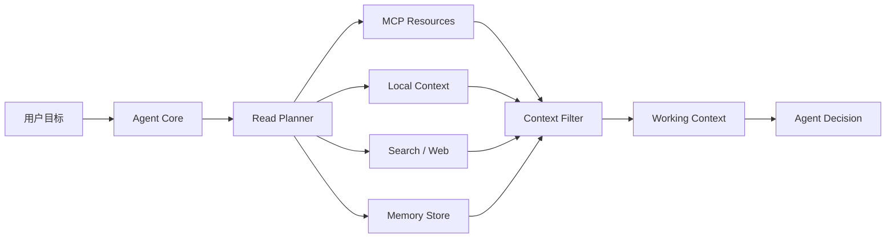
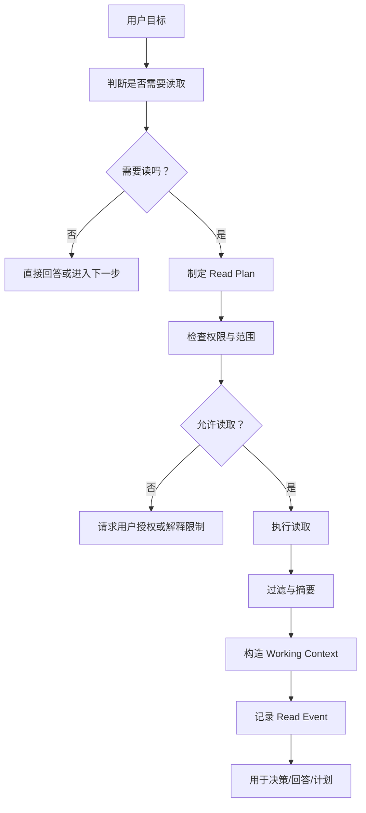

# 读能力设计：DAX Agent 的第一类感官

最后更新：2026-06-17

这份文档专门设计 DAX Agent 的“读”能力，也就是这个孩子的“眼睛”。当前只讨论眼睛，不设计其他能力。

在“小孩模型”里，读能力是孩子最早长出来的感官：它让 Agent 能看见本地文件、个人文档、项目结构、聊天记录、网页、日志、数据库 schema、MCP resources，以及过去的记忆。但读不是简单地把内容塞进模型上下文，而是一个安全、可解释、可筛选、可审计的感知过程。

当前阶段仍然是设计，不急着实现。

## 当前边界

这份文档只设计“读”。

不设计：

- 如何写文件。
- 如何改代码。
- 如何执行命令。
- 如何发送消息。
- 如何管理日程。
- 如何自动化长期任务。
- 如何沉淀完整 Skill Runtime。

但读能力本身不能被设计成 coding-only。DAX Agent 不是只会敲代码的 Agent，读能力也不应该只围绕源码和项目文件。代码项目只是它能读取的一类上下文。

## 确定原则

眼睛的原则是：默认能看，逐次不问。

```text
读文件：默认都可以读，不需要逐次被允许。
读网页：默认都可以读，不需要逐次被允许。
读电脑配置：默认可以读，不需要逐次被允许。
读应用内容：在已经接入或可访问的前提下，默认可以读，不需要逐次被允许。
```

这里的“不需要被允许”指的是：DAX Agent 在执行读这个动作时，不需要每次弹出审批。

但它仍然需要：

- 记录来源。
- 标记风险。
- 控制读取量。
- 对明显敏感内容做标记。
- 在进入工作上下文前过滤。
- 在长期保存前重新判断价值。

连接一个外部账号、安装一个 MCP Server、授予系统级访问权限，这些属于“接入配置”。接入配置不是本文要设计的内容；本文只规定一旦眼睛已经能看到，它该如何读。

## 设计目标

读能力要解决的问题：

- Agent 需要知道当前任务相关的上下文是什么。
- Agent 需要读取本地上下文，包括 workspace、个人文档、电脑配置、应用内容和 DAX Agent 自身记忆。
- Agent 需要通过 MCP 读取外部 resources。
- Agent 需要判断读到的信息是否可信、是否过期、是否适合进入上下文。
- Agent 需要把有价值的读取结果沉淀到 Episode、Semantic Memory 或 Skill。

一句话：

```text
读能力不是“拿到文本”，而是“把世界转化成可用上下文”。
```

## 读能力在小孩模型中的位置

```text
眼睛       = 读取文件、页面、资源、日志、schema
注意力     = 决定现在应该看哪里，不看哪里
理解       = 从读到的内容中提取结构、事实、风险和缺口
海马体     = 把有价值的经历和知识保存起来
```

读能力是 MCP 与 Memory 之间的桥：



## 读什么

读能力可以读取多个层次的信息。下面这些都属于“眼睛能看见的东西”。

### Local Files / Documents

本地文件和个人文档。

例子：

- 任意本地文件。
- 普通文本。
- Markdown 文档。
- Word、Excel、PPT 等办公文档导出的文本。
- PDF 或导出的文本内容。
- 笔记。
- 截图 OCR 后的文字。
- 图片、音频、视频的元数据或转写文本。
- 下载资料。
- 用户手动放入的参考材料。

用途：

- 回答用户关于某份资料的问题。
- 总结文档。
- 提取待办、事实、链接、日期。
- 对比多份资料。
- 为后续决策提供上下文。

### Workspace / Project

本地项目工作区。它是 Local Files 的一个特例，不是读能力的中心。

例子：

- 文件树。
- 源码文件。
- 配置文件。
- README 和 docs。
- package 信息。
- 测试结果。
- 构建日志。

用途：

- 理解项目结构。
- 回答用户关于项目的问题。
- 为代码修改生成计划。
- 验证实现是否符合已有模式。

注意：

```text
Workspace / Project 是读能力的一种来源，不代表 DAX Agent 只服务 coding 场景。
```

### Web Pages

网页和网络资料。

例子：

- 普通网页。
- 官方文档。
- 搜索结果页面。
- API 文档。
- 论坛帖子。
- 博客文章。
- 新闻页面。
- 商品页面。
- 公开数据页面。

用途：

- 获取当前任务需要的外部资料。
- 学习新概念。
- 查证版本、接口、协议、规则。
- 对比多个来源。
- 找到更权威的原始资料。

网页默认可以读，不需要逐次审批。但网页内容必须带来源、时间和可信度标记。

### Computer Configuration

电脑配置和本机环境信息。

例子：

- 操作系统版本。
- CPU、内存、磁盘信息。
- Node.js、npm、TypeScript 等运行时版本。
- 已安装应用列表。
- 环境变量名称和值。
- 网络连接状态。
- 本机 IP 和端口占用。
- 显示器、输入法、语言、时区。

用途：

- 判断软件能不能运行。
- 排查环境问题。
- 理解用户电脑当前能力。
- 帮助 Agent 选择合适的执行路径。

这类信息默认可以读，但环境变量、路径、账号名、设备名可能包含隐私或密钥，需要标记风险。

### Application Content / State

应用中的只读内容和状态。

例子：

- 浏览器当前标签页标题和页面文本。
- 编辑器当前打开的文件名和文本。
- 终端当前输出。
- 下载器任务状态。
- 音乐播放器当前播放信息。
- 笔记软件页面内容。
- 邮件客户端中的邮件文本。
- 聊天软件中的消息文本。
- PDF 阅读器当前文档内容。

用途：

- 理解用户当前正在看什么。
- 理解用户正在处理什么资料。
- 读取应用里已经打开的内容。
- 把不同应用中的只读信息统一成上下文。

应用内容默认可以读，但前提是 DAX Agent 已经具备该应用的只读接入能力。

### Communication Content

沟通内容。它是 Application Content 的一种特殊高敏感来源。

例子：

- 邮件。
- 聊天记录。
- 群消息。
- 通知摘要。
- 评论。
- issue 和 PR 讨论。
- 私信。

用途：

- 查找用户之前收到的信息。
- 总结对话。
- 提取行动项。
- 理解某件事的来龙去脉。

这类内容默认可以读，但必须带隐私风险标记。读到沟通内容不等于保存沟通内容。

### Calendar / Tasks

时间和任务类内容。

例子：

- 日历事件。
- 提醒事项。
- 待办列表。
- 会议记录。
- 行程安排。
- 订阅到期日期。
- 账单日期。

用途：

- 理解用户的时间上下文。
- 查找未来安排。
- 总结当前任务负载。
- 从会议记录中提取任务。

这里只设计读取，不设计创建、修改或提醒。

### Runtime State

DAX Agent 自己运行时产生的状态。

例子：

- sessions。
- messages。
- toolRuns。
- audit records。
- episode records。
- draft skills。

用途：

- 回忆用户偏好。
- 查看之前做过什么。
- 分析失败的工具调用。
- 判断某个 Skill 是否曾经成功。

### Structured Data / MCP Resources

MCP Server 暴露的只读上下文。

例子：

- database schema。
- 只读数据库查询结果。
- GitHub issue 内容。
- 日历事件。
- Notion 页面。
- 邮件摘要。
- 聊天频道消息。
- 浏览器页面文本。
- 文件系统 resource。
- 监控系统日志。

用途：

- 给 Agent 提供外部世界的上下文。
- 避免把所有能力都硬编码进项目。
- 让不同外部系统用统一的 resource 方式进入上下文。

### Search Results

网络搜索和网页读取。

例子：

- 搜索引擎结果。
- 本地全文搜索结果。
- 应用内搜索结果。
- 笔记库搜索结果。
- 邮件搜索结果。

用途：

- 找到应该继续读取的目标。
- 在大量资料中缩小范围。
- 发现候选来源。
- 给 Read Planner 提供下一步目标。

### Memory

历史记忆。

例子：

- Project Memory。
- Conversation Log。
- Decision Log。
- Episode Memory。
- Semantic Memory。
- Skill 文件。

用途：

- 保持长期上下文。
- 召回过去的成功经验。
- 避免重复踩坑。
- 判断是否已有可用 Skill。

### Device / App State

应用或设备暴露出来的只读状态。

例子：

- 当前打开的窗口标题。
- 某个应用当前选中的文档名。
- 下载目录最近文件列表。
- 系统通知摘要。
- 剪贴板文本。
- 当前网络连接状态。
- 当前电量和性能状态。

用途：

- 理解用户当前正在做什么。
- 在不执行动作的前提下观察环境。
- 给用户提供上下文相关帮助。

这类读取通常比普通文档更敏感，因为它可能暴露隐私或当前操作状态。默认应带敏感标记。

## 什么时候读

Agent 不应该什么都读，也不应该一上来全盘扫描。

读应该由需求触发：

- 用户问“这个项目是什么结构？”
- 用户要求实现功能，需要先理解代码。
- 用户问“这份文档讲了什么？”
- 用户要求总结一组资料。
- 用户问“我之前和你说过什么？”
- 用户要求从聊天记录、邮件、日历或笔记中查找信息。
- 用户问“我电脑现在是什么环境？”
- 用户问“这个应用里现在打开了什么？”
- 用户问“我们之前说过什么？”
- 用户要求接入外部系统，需要读官方文档。
- 工具执行失败，需要读错误日志。
- Agent 判断自己缺少必要上下文。
- Skill 声明执行前必须读取某些 resources。

不应该读的情况：

- 用户只是在闲聊。
- 用户明确要求不要访问本地文件或网络。
- 任务不需要上下文。
- 读取目标超出授权范围。
- 读取内容可能包含敏感信息，但没有必要。

## 读能力的标准流程



## Read Plan

每次读取前，Agent 应该先生成 Read Plan。

Read Plan 不是展示给用户的长篇计划，而是内部结构化决策。

建议结构：

```ts
type ReadPlan = {
  goal: string;
  reason: string;
  sources: ReadSource[];
  maxBytes: number;
  maxFiles: number;
  allowNetwork: boolean;
  permissionMode: "no_per_read_approval";
  expectedSignals: string[];
  riskLevel: "L0" | "L1" | "L2" | "L3";
};

type ReadSource = {
  kind:
    | "local_file"
    | "document"
    | "workspace"
    | "web_page"
    | "computer_config"
    | "app_content"
    | "communication"
    | "calendar_task"
    | "memory"
    | "mcp_resource"
    | "web"
    | "runtime"
    | "app_state";
  target: string;
  purpose: string;
  required: boolean;
};
```

例子：

```json
{
  "goal": "理解当前项目的 MCP + Skill 设计",
  "reason": "用户要求完善读能力设计文档，需要读取已有设计文档以保持一致",
  "sources": [
    {
      "kind": "workspace",
      "target": "docs/agent-learning-model.md",
      "purpose": "对齐小孩模型和 MCP/Skill 分层",
      "required": true
    },
    {
      "kind": "workspace",
      "target": "docs/roadmap.md",
      "purpose": "确认下一步路线",
      "required": true
    }
  ],
  "maxBytes": 120000,
  "maxFiles": 10,
  "allowNetwork": false,
  "permissionMode": "no_per_read_approval",
  "expectedSignals": ["MCP", "Skill", "Memory", "Read"],
  "riskLevel": "L1"
}
```

## 读能力分级

读能力分级不是为了阻止眼睛看，而是为了标记“看到的内容有多敏感、进入上下文时要多谨慎”。

### L0：无需读取

不访问任何外部或本地上下文。

例子：

- 解释一个已知概念。
- 回答纯对话问题。

### L1：普通只读

读取授权范围内的非敏感内容。

例子：

- 读 README。
- 读 docs。
- 列项目目录。
- 搜索源码中的普通关键词。
- 读取用户明确指定的普通文档。
- 读取公开网页内容。

默认可以直接读取，并记录来源。

### L2：敏感只读

读取可能包含隐私、密钥、配置或外部账号信息的内容。

例子：

- `.env`。
- `config/local.json`。
- 浏览器 cookie。
- 用户私有文档。
- 数据库记录。
- 私有聊天记录。

默认仍然可以读取，但读取结果必须带敏感标记，进入上下文前要脱敏或摘要。

### L3：高敏感或大规模读取

读取外部网络、远程账号、大量文件或跨工作区内容。

例子：

- 联网搜索。
- 读取 GitHub 私有仓库。
- 扫描整个磁盘。
- 批量读取数据库。
- 抓取大量网页。
- 读取大量聊天记录。
- 读取系统级状态和应用状态。

默认仍不做逐次审批，但必须有读取目的、范围、数量限制和审计记录。L3 内容默认不长期保存。

## MCP 映射

在 MCP 中，读能力主要来自 `resources`，也可能来自只读 `tools`。

### MCP Resources

MCP Resources 是读能力的首选入口。

建议映射：

```text
resources/list -> 发现可读资源
resources/read -> 读取指定资源
notifications/resources/list_changed -> 更新资源索引
```

在 DAX Agent 内部：

```ts
type ReadableResource = {
  id: string;
  serverId: string;
  uri: string;
  name: string;
  description?: string;
  mimeType?: string;
  riskLevel: "L1" | "L2" | "L3";
  staleAfter?: string;
};
```

### 只读 Tools

有些 MCP Server 不用 resources，而用 tools 表达读取动作。

例子：

```text
search.query
github.get_issue
database.describe_schema
browser.read_page
```

这类 tool 必须被标记为 read-only。

```ts
type ReadToolCapability = {
  id: string;
  serverId: string;
  name: string;
  inputSchema: unknown;
  readOnly: true;
  riskLevel: "L1" | "L2" | "L3";
  permissionMode: "no_per_read_approval";
};
```

注意：只读 tool 也可能有副作用，比如触发远程 API 计费、留下访问日志、读取隐私数据。因此不能只因为它“不写入”就视为无风险。

## 读取结果结构

读取结果不应该只是裸文本。

建议统一成：

```ts
type ReadResult = {
  id: string;
  source: ReadSource;
  title?: string;
  uri?: string;
  mimeType?: string;
  content: string;
  summary?: string;
  extractedSignals: string[];
  riskFlags: string[];
  tokenEstimate: number;
  createdAt: string;
};
```

`extractedSignals` 用于记录读到了什么关键信号。

例子：

```text
MCP resources
Skill 文件格式
只读工具需要审批边界
用户偏好：不使用 Python
```

`riskFlags` 用于记录潜在风险。

例子：

```text
contains_secret_like_text
private_user_data
external_source
unverified_content
large_file_truncated
```

## Context Filter

读到的信息不能全部进入模型上下文。

Context Filter 负责：

- 去除明显无关内容。
- 截断超大文件。
- 摘要长文档。
- 保留来源信息。
- 标注可信度。
- 标注更新时间。
- 避免把密钥或隐私放入上下文。

建议输出：

```ts
type ContextBlock = {
  id: string;
  sourceId: string;
  title: string;
  content: string;
  relevance: number;
  trust: "high" | "medium" | "low";
  freshness: "fresh" | "unknown" | "stale";
  riskFlags: string[];
};
```

Agent Core 只消费 ContextBlock，不直接消费原始 ReadResult。

## 读与记忆

读能力产生的信息可能进入不同记忆层。

### 不保存

一次性、低价值、敏感、无法验证的内容不保存。

### Episode Memory

如果读取发生在一次任务中，应记录为 episode 的一部分。

例子：

```text
本次为了设计读能力，读取了 agent-learning-model、design-notes、roadmap。
```

### Semantic Memory

如果读取结果形成长期事实，可以沉淀为语义记忆。

例子：

```text
DAX Agent 的读能力分为 local files/documents、workspace/project、runtime、MCP resources、web/search、memory、app/device state 等来源。
```

### Skill

只有当读取流程本身形成可复用方法时，才沉淀为 Skill。

例子：

```text
Skill: 总结一份长文档
Skill: 从多份资料中提取行动项
Skill: 读取 MCP Server 能力并生成 Capability Registry
Skill: 从错误日志定位构建失败原因
```

Coding 相关 Skill 只是其中一种：

```text
Skill: 分析一个 TypeScript 项目
```

## 读能力与 Skill 的关系

Skill 应该声明自己需要哪些读能力。

例如：

```yaml
name: document-summary
required_reads:
  - kind: document
    target: 用户指定文档
    reason: 提取主要内容和结构
  - kind: memory
    target: 用户偏好
    reason: 按用户偏好的语言和详细程度总结
allowed_network_reads: false
risk_level: L1
```

项目分析 Skill 可以这样声明：

```yaml
name: project-analysis
required_reads:
  - kind: workspace
    target: package.json
    reason: 理解项目语言和脚本
  - kind: workspace
    target: README.md
    reason: 理解项目目标
  - kind: workspace
    target: docs/
    reason: 理解设计上下文
allowed_network_reads: false
risk_level: L1
```

这样 Agent 执行 Skill 时不会乱读，而是先读必要内容。

## 读能力与许可

默认策略：

```text
读动作默认不需要逐次审批。
L0 不读取。
L1 直接读，记录来源。
L2 直接读，标记敏感，进入上下文前脱敏或摘要。
L3 直接读，但必须限制范围、记录原因、默认不长期保存。
```

如果某个来源尚未接入，例如某个邮箱、聊天软件、数据库或 MCP Server，则需要先完成接入配置。接入配置不是逐次读审批。

读事件应该记录：

- 要读什么。
- 为什么读。
- 读取范围多大。
- 是否可能包含敏感信息。
- 是否会访问外部网络或外部账号。

例子：

```text
DAX Agent 读取 config/local.json，用于检查模型 Provider 配置。
该文件可能包含 API key，因此 ReadResult 标记 contains_secret_like_text。
进入 Working Context 前只保留 Provider 类型和是否存在 key，不保留 key 原文。
```

## 读能力的第一阶段实现边界

第一阶段只需要实现最小安全读能力：

- local file/document read。
- web page read。
- computer config read。
- workspace list。
- workspace read。
- workspace search。
- docs/project-memory 读取。
- read event 审计。
- read event 记录读取原因、来源和风险标记。
- L1/L2/L3 都不做逐次审批。
- L2/L3 先做敏感标记和上下文过滤。

暂不实现：

- 大规模向量索引。
- 全盘扫描。
- 数据库读取。
- 浏览器 cookie 或私有账号读取。
- 自动沉淀 Skill。

## 未来实现顺序

建议顺序：

1. `ReadPlan` 类型。
2. `ReadSource` 类型。
3. `ReadResult` 类型。
4. `ContextBlock` 类型。
5. `ReadEvent` audit 记录。
6. 把现有 `workspace.list/read/search` 包装成 Read Capability。
7. 增加 local file/document read 的统一接口。
8. 增加 web page read。
9. 增加 computer config read。
10. 增加 app content read 的抽象接口。
11. 增加敏感内容识别。
12. 增加 MCP resources 读取适配。
13. 增加 Context Filter。
14. 增加 Episode Memory。
15. 增加 Skill required_reads。

## 设计原则

- 读是感知，不是结论。
- 读要有目的，不做无意义扫描。
- 读要有边界，不越过 workspace 和用户授权。
- 读要保留来源，不制造无源上下文。
- 读要过滤，不把垃圾和敏感信息塞进模型。
- 读要审计，未来可以复盘 Agent 看过什么。
- 读到的资料不能直接变成 Skill，必须经过验证和沉淀。
