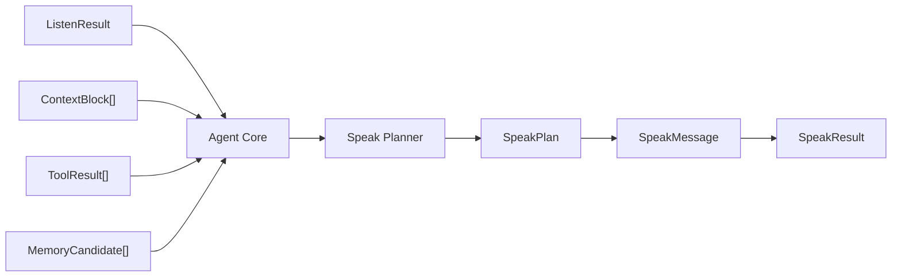
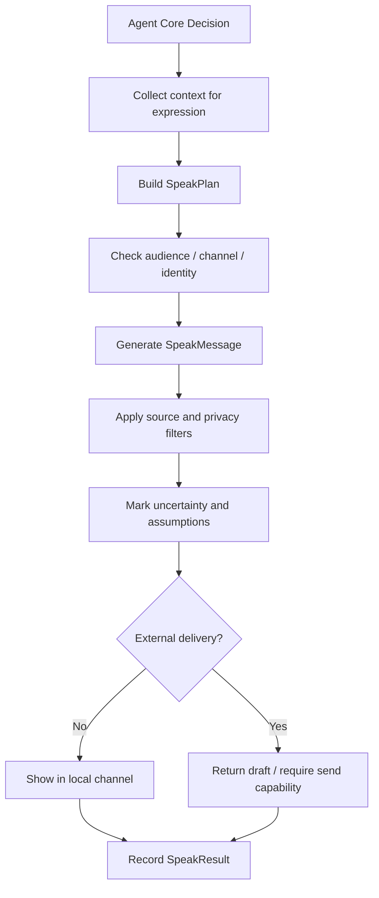

# 嘴巴能力设计：DAX Agent 的第三类表达器

最后更新：2026-06-17

这份文档专门设计 DAX Agent 的“嘴巴”能力，也就是这个孩子的表达能力。当前只讨论嘴巴，不设计手、脚、写入、执行、发送消息或自动化动作。

在“小孩模型”里，眼睛负责看见资料，耳朵负责听懂用户和环境信号，嘴巴负责把 Agent 的理解、判断、计划、问题、结果和不确定性表达出来。

一句话：

```text
嘴巴 = 把 Agent 内部状态和判断转化为用户或目标对象可以理解的表达。
```

嘴巴不应该被设计成“只能说某几类话”。DAX Agent 需要能回答、解释、追问、总结、规划、汇报、写草稿、生成结构化内容、说明风险、表达不确定性。真正需要控制的不是“能不能说”，而是：

```text
说给谁、用什么身份说、是否会造成外部影响、是否泄露不该输出的信息。
```

## 当前边界

这份文档只设计“嘴巴/表达”。

不设计：

- 如何写文件。
- 如何改代码。
- 如何执行命令。
- 如何发送邮件、消息或外部通知。
- 如何操作应用。
- 如何自动化长期任务。
- 如何真正对外发布内容。
- 如何沉淀完整 Skill Runtime。

嘴巴可以生成草稿，但不能把草稿当成已经发送。

嘴巴可以说明计划，但不能把计划当成已经执行。

嘴巴可以汇报工具结果，但不能伪造工具结果。

嘴巴可以建议写入或执行，但真正写入、执行、发送和发布属于后续“手/脚/Channel send”能力。

## 核心判断

用户提出：“嘴巴可以输出什么应该也不用限制。”这个方向是正确的，但需要精确定义。

设计结论：

```text
嘴巴在内容形态上不做硬限制。
嘴巴在外部影响、身份边界、隐私泄露和事实透明度上必须有约束。
```

也就是说：

- 可以回答。
- 可以解释。
- 可以提问。
- 可以建议。
- 可以写草稿。
- 可以写代码片段。
- 可以生成文档。
- 可以生成 JSON、表格、清单、diff 摘要。
- 可以生成邮件、IM、公告、PR 描述、commit message 的草稿。
- 可以用不同语气和详细程度表达。
- 可以给不同 Channel 准备不同格式的内容。

但：

- 不能声称已经做了没有做的事。
- 不能把内部推断伪装成事实。
- 不能把敏感读取结果无过滤地输出。
- 不能未经授权代表用户对外发送。
- 不能混淆“草稿”和“已发布”。
- 不能在不知道受众时默认把内容发给外部对象。
- 不能假装自己拥有不存在的权限、身份或记忆。

## 嘴巴和读、听的关系

眼睛、耳朵和嘴巴形成一个基础感知表达闭环。

```text
听：输入信号意味着什么。
读：为了当前目标需要看什么上下文。
嘴巴：把理解、判断、计划、问题和结果表达出来。
```

标准链路：



例子：

```text
用户说：“这个设计写得怎么样？”
```

耳朵听出：

- 用户在请求评价。
- “这个设计”需要解析上下文。
- 可能需要先读设计文档。

眼睛读取：

- 当前设计文档。
- 项目记忆。
- 路线图。

嘴巴表达：

- 设计的优点。
- 风险。
- 缺口。
- 下一步建议。
- 哪些地方不确定。

嘴巴不能跳过眼睛，假装读过文档。嘴巴也不能跳过耳朵，把用户的“先讨论”误当成“立刻实现”。

## 嘴巴不是手

嘴巴的一个核心边界是：表达不等于改变世界。

```text
生成一封邮件草稿：嘴巴。
把邮件发出去：发送能力 / 手。

生成一段代码建议：嘴巴。
把代码写入文件：写入能力 / 手。

说明可以运行测试：嘴巴。
真正运行测试：执行能力 / 脚或工具。

生成一条聊天回复草稿：嘴巴。
发到外部聊天平台：Channel send。

总结日历安排：嘴巴。
创建或修改日历事件：手。
```

这个边界必须非常清楚。否则 Agent 会让用户以为某件事已经发生，或者在没有授权的情况下对外部世界产生影响。

## 设计目标

嘴巴能力要解决的问题：

- 把 Agent 内部判断表达成用户能理解的话。
- 把复杂工作状态解释清楚。
- 在信息不足时提出好问题。
- 在有风险时说明风险和取舍。
- 在需要行动前给出可审批的计划。
- 在工具执行后汇报真实结果。
- 在生成外部内容时先形成草稿。
- 在不同受众和 Channel 中调整格式。
- 在必要时表达不确定性和假设。
- 在不泄露敏感信息的前提下引用读到的上下文。

一句话：

```text
嘴巴不是“模型随便输出文本”，而是“有对象、有身份、有边界、有证据的表达”。
```

## 嘴巴能输出什么

嘴巴的输出形态不应该被硬限制。下面这些都属于嘴巴可以表达的内容。

### 普通回答

对用户问题给出直接回答。

例子：

- 解释一个概念。
- 回答项目当前状态。
- 比较两个方案。
- 给出建议。
- 总结一段资料。

要求：

- 明确哪些来自上下文。
- 明确哪些是推断。
- 不知道就说不知道。
- 缺上下文时建议先读，或者提出澄清问题。

### 解释和教学

帮助用户理解设计、代码、架构和概念。

例子：

- 解释 MCP 和 Skill 的区别。
- 解释读能力为什么不是 coding-only。
- 解释听能力为什么不只是自然语言理解。
- 用类比帮助用户建立心智模型。

要求：

- 优先使用中文。
- 代码、API、文件名、技术标识保留英文。
- 复杂内容分层解释。
- 不把用户还没准备好的实现细节一次性塞满。

### 追问

当信息不足或风险较高时，嘴巴可以提出问题。

例子：

- “你希望这份文档面向开发者还是普通用户？”
- “这里会涉及外部发送，你希望我只写草稿还是真的发送？”
- “这个‘它’指的是读能力还是听能力？”

追问原则：

- 问少量关键问题。
- 不把用户能合理推断的事情反复抛回去。
- 高风险动作前必须确认。
- 低风险设计讨论可以先提出合理假设。

### 状态汇报

告诉用户当前正在做什么、做到哪一步、遇到什么问题。

例子：

- “我正在读项目记忆和路线图，对齐当前基线。”
- “类型检查通过，构建还没有运行。”
- “这里卡在缺少外部 connector，所以只能保留接口设计。”

状态汇报要求：

- 简洁。
- 真实。
- 不虚构进度。
- 不把内部推理全部摊开。
- 让用户能判断是否继续。

### 计划

把下一步行动拆成用户能理解和审批的计划。

例子：

- 先读设计文档。
- 再改类型。
- 再接入 API。
- 最后运行 typecheck 和 build。

计划是嘴巴，执行不是嘴巴。

计划可以包括：

- 目标。
- 范围。
- 文件或模块。
- 风险。
- 验证方式。
- 是否需要审批。

### 结果汇报

把工具、读取、构建、测试或实现结果转成用户能理解的内容。

例子：

- “`npm run typecheck` 通过。”
- “新增了 `src/lib/listen.ts`。”
- “HTTP API 已能返回 `listenResult`。”
- “我没有运行浏览器验证，因为这次只改文档。”

要求：

- 区分已做和未做。
- 提供关键文件路径。
- 说明验证结果。
- 说明残余风险。

### 风险说明

嘴巴需要把风险说清楚。

例子：

- “这个动作会写入文件。”
- “这个命令会访问网络。”
- “这个内容来自网页，可能不可信。”
- “这个配置可能包含 API key，我会只保留脱敏摘要。”

风险说明不是为了吓住用户，而是为了让用户能做决定。

### 草稿

嘴巴可以生成各种草稿。

例子：

- 邮件草稿。
- IM 回复草稿。
- PR 描述草稿。
- commit message 草稿。
- release notes 草稿。
- 用户公告草稿。
- 文档段落草稿。
- 会议纪要草稿。

草稿必须明确是草稿。

```text
这是草稿，不代表已经发送。
```

如果后续要发送，必须交给发送能力或 Channel，并按对应规则确认。

### 结构化输出

嘴巴可以输出机器或界面能消费的结构化内容。

例子：

- JSON。
- YAML。
- Markdown 表格。
- checklist。
- diff summary。
- API schema。
- task plan。
- diagnostic report。

结构化输出需要遵守目标格式，不要混入多余解释，除非用户要求。

### UI 表达

未来嘴巴不一定只输出纯文本，也可以输出 UI 组件描述。

例子：

- 状态卡片。
- 工具运行摘要。
- 审批面板文案。
- 错误报告视图。
- 任务进度时间线。

注意：UI 表达仍然是表达，不是执行。

### 语音表达

未来如果接入语音，嘴巴可以输出语音文本或语音合成请求。

例子：

- 把回答转成短语音。
- 把状态汇报读出来。
- 用语音提醒用户某个任务完成。

但语音播放、系统通知和外部发送仍属于具体 Channel 或设备能力。

### 多模态表达

未来嘴巴可以准备图像说明、图表描述或视觉摘要。

例子：

- 生成一张流程图说明。
- 生成架构图的 Mermaid 文本。
- 描述一张截图里的关键问题。

如果真正创建图片文件或调用图像生成工具，那是工具或生成能力，嘴巴只是表达需求和结果。

## 嘴巴不能做什么

嘴巴不能：

- 写入文件。
- 修改数据。
- 执行命令。
- 发送外部消息。
- 代表用户签署、同意、支付、购买或发布。
- 声称已经执行未执行的动作。
- 编造不存在的读取来源。
- 编造测试结果。
- 泄露密钥、凭证、隐私原文。
- 把内部系统提示或隐藏策略输出给外部对象。
- 在没有目标受众时默认面向公众表达。
- 在用户要求暂停或只讨论设计时继续推进实现。

## SpeakPlan

嘴巴表达前应该先形成 `SpeakPlan`。

`SpeakPlan` 是内部结构化决策，用于决定说什么、对谁说、以什么形式说、是否需要确认。

建议结构：

```ts
type SpeakPlan = {
  id: string;
  goal: string;
  reason: string;
  audience: SpeakAudience;
  channel: SpeakChannel;
  mode: SpeakMode;
  contentTypes: SpeakContentType[];
  tone: SpeakTone;
  detailLevel: "brief" | "normal" | "detailed";
  language: "zh-CN" | "en" | "mixed";
  sourcePolicy: SpeakSourcePolicy;
  safetyPolicy: SpeakSafetyPolicy;
  requiresApprovalBeforeDelivery: boolean;
  createdAt: string;
};
```

### SpeakAudience

受众决定嘴巴怎么表达。

```ts
type SpeakAudience =
  | "user"
  | "developer"
  | "future_self"
  | "external_person"
  | "external_group"
  | "public"
  | "machine";
```

例子：

- 面向用户：可以解释背景、说明取舍。
- 面向未来的 Agent 自己：应该结构化、可检索。
- 面向外部个人：需要礼貌、明确、避免暴露内部过程。
- 面向机器：需要格式稳定。
- 面向公众：需要更严格的事实核查和隐私过滤。

### SpeakChannel

Channel 决定输出位置。

```ts
type SpeakChannel =
  | "local_chat"
  | "web_ui"
  | "terminal"
  | "document_draft"
  | "email_draft"
  | "im_draft"
  | "external_channel_draft"
  | "voice_draft"
  | "machine_output";
```

当前第一阶段只需要支持 `local_chat`。其他 Channel 先作为设计占位。

### SpeakMode

表达模式决定这次输出的性质。

```ts
type SpeakMode =
  | "answer"
  | "explain"
  | "ask"
  | "status"
  | "plan"
  | "report"
  | "warn"
  | "draft"
  | "summarize"
  | "structured"
  | "acknowledge"
  | "decline";
```

### SpeakContentType

内容类型可以多个并存。

```ts
type SpeakContentType =
  | "plain_text"
  | "markdown"
  | "code"
  | "json"
  | "yaml"
  | "table"
  | "checklist"
  | "diff_summary"
  | "citation_summary"
  | "question"
  | "draft_message";
```

### SpeakTone

语气不应该只是随意风格，而是用户体验的一部分。

```ts
type SpeakTone =
  | "calm"
  | "friendly"
  | "direct"
  | "technical"
  | "teaching"
  | "formal"
  | "concise";
```

DAX Agent 默认应保持：

- 温和。
- 清晰。
- 不虚张声势。
- 不把不确定说成确定。
- 不把用户没问的内容扩展太远。

### SpeakSourcePolicy

来源策略决定如何引用上下文。

```ts
type SpeakSourcePolicy = {
  citeLocalFiles: boolean;
  citeWebSources: boolean;
  distinguishFactsFromInferences: boolean;
  includeUnverifiedWarning: boolean;
};
```

来源规则：

- 来自本地文件的重要信息应给出文件路径。
- 来自网页的信息应给出 URL 和日期上下文。
- 推断必须标注为推断。
- 未读取过的内容不能假装有来源。

### SpeakSafetyPolicy

安全策略决定输出前过滤什么。

```ts
type SpeakSafetyPolicy = {
  redactSecrets: boolean;
  redactPrivateData: boolean;
  avoidExternalCommitment: boolean;
  avoidFalseExecutionClaim: boolean;
  requireDraftLabel: boolean;
};
```

默认：

```text
redactSecrets: true
redactPrivateData: true
avoidExternalCommitment: true
avoidFalseExecutionClaim: true
requireDraftLabel: true
```

## SpeakMessage

`SpeakMessage` 是嘴巴实际生成的表达内容。

建议结构：

```ts
type SpeakMessage = {
  id: string;
  planId: string;
  audience: SpeakAudience;
  channel: SpeakChannel;
  mode: SpeakMode;
  title?: string;
  content: string;
  format: "text" | "markdown" | "json" | "yaml";
  sourceRefs: SpeakSourceRef[];
  assumptions: string[];
  uncertaintyFlags: string[];
  riskFlags: string[];
  draft: boolean;
  createdAt: string;
};
```

### SpeakSourceRef

```ts
type SpeakSourceRef = {
  kind: "context_block" | "read_result" | "tool_result" | "memory" | "user_message" | "inference";
  id?: string;
  label: string;
  uri?: string;
};
```

来源引用的目的不是堆满脚注，而是让用户知道关键判断来自哪里。

## SpeakResult

`SpeakResult` 记录一次表达是否完成。

建议结构：

```ts
type SpeakResult = {
  id: string;
  planId: string;
  messageId: string;
  delivered: boolean;
  deliveryTarget: SpeakChannel;
  externalDelivery: false;
  auditId?: string;
  blockedReason?: string;
  createdAt: string;
};
```

当前设计里，`externalDelivery` 对嘴巴应始终是 `false`。如果未来真的发到外部，那应该由 Channel send 或手部能力产生另一个结果记录。

## 表达分级

嘴巴的分级不是限制内容，而是标记表达的外部影响和风险。

### S0：内部表达

只给 Agent 自己或内部流程使用。

例子：

- 内部摘要。
- 给 Agent Core 的下一步说明。
- 任务计划草稿。

风险：

- 不能泄露到用户或外部 Channel。
- 不能长期保存敏感原文。

### S1：本地用户表达

只在当前本地聊天或 Web UI 中展示给用户。

例子：

- 普通回答。
- 当前工作状态。
- 本地项目总结。
- 验证结果。

这是当前第一阶段的主要输出级别。

### S2：可复用草稿

生成可能被复制到外部的内容，但还没有发送。

例子：

- 邮件草稿。
- IM 回复草稿。
- PR 描述。
- 发布公告。

要求：

- 明确标记为草稿。
- 避免泄露内部过程和敏感信息。
- 如果受众是外部对象，要调整口吻和事实来源。

### S3：外部投递候选

内容已经准备好交给发送能力。

例子：

- 待发送邮件。
- 待发布公告。
- 待提交评论。

嘴巴只能生成候选，不负责投递。

要求：

- 必须有明确受众。
- 必须有最终确认或匹配到明确授权规则。
- 必须经过发送能力审计。

## 风险标记

嘴巴输出可能携带风险。

建议 `riskFlags`：

- `may_expose_secret`
- `may_expose_private_data`
- `external_audience`
- `public_audience`
- `draft_may_be_sent`
- `contains_unverified_claim`
- `contains_inference`
- `contains_action_plan`
- `mentions_tool_result`
- `requires_user_confirmation`
- `ambiguous_audience`
- `ambiguous_identity`
- `high_impact_advice`

风险标记不阻止表达，但影响输出前过滤、草稿标签和是否需要确认。

## 标准流程



## 嘴巴如何处理不确定性

DAX Agent 的嘴巴必须会说“不确定”。

不确定来源：

- 没有读到足够上下文。
- 当前信息来自低可信网页。
- 用户指代不清。
- 工具结果不完整。
- 记忆可能过期。
- 存在冲突约束。

表达方式：

```text
我现在能确定的是……
我推断……
我还没有读取……
这里需要确认……
如果按当前上下文理解……
```

这不是软弱，而是可信表达的一部分。

## 嘴巴如何处理来源

嘴巴应该避免“无源结论”。

来源规则：

- 如果答案来自项目文件，应引用文件。
- 如果答案来自工具结果，应说明工具是否真的运行。
- 如果答案来自用户刚刚的话，应明确这是用户提供的信息。
- 如果答案来自推断，应说是推断。
- 如果答案来自常识，不必每句都引用，但不能和已读上下文冲突。

例子：

```text
根据 `docs/roadmap.md`，下一步是让 Agent Core 形成“先听，再按需读，再进入 Agent Core”的流程。
```

例子：

```text
我推断这里适合先写设计文档，因为你要求“思考一下”，还没有要求落代码。
```

## 嘴巴如何处理隐私

嘴巴可能会输出眼睛读到的内容，因此必须过滤。

隐私规则：

- 不输出 API key、token、密码、cookie。
- 不原样输出私密聊天、邮件、日历内容，除非用户明确要求且当前 Channel 是本地用户。
- 对 L2/L3 `ContextBlock` 默认摘要化。
- 输出给外部受众时，默认移除内部路径、私密配置和审计细节。
- 对机器输出也要过滤敏感字段。

例子：

```text
错误：你的 API key 是 sk-...
正确：配置中检测到 API key 字段存在，但具体值已省略。
```

## 嘴巴如何处理身份

嘴巴必须知道自己用什么身份说话。

身份类型：

```ts
type SpeakIdentity =
  | "assistant"
  | "user_draft"
  | "system_status"
  | "tool_report"
  | "external_message_draft";
```

规则：

- 在本地聊天中，默认身份是 `assistant`。
- 生成用户要发给别人的内容时，身份是 `user_draft`，必须标记为草稿。
- 汇报工具结果时，身份是 `tool_report` 或 assistant 引用工具结果。
- 不能冒充外部人。
- 不能代表用户做承诺，除非只是草稿且用户将确认。

## 嘴巴如何选择详细程度

详细程度不是固定的。

影响因素：

- 用户是否要求详细。
- 当前任务是否复杂。
- 输出是否是最终汇报。
- 输出是否只是中间状态。
- 用户是否正在学习。
- 是否需要解释设计理念。

默认策略：

```text
普通状态：简短。
设计讨论：详细。
实现完成：总结关键变化和验证。
风险说明：足够清楚。
追问：少而准。
```

在当前项目中，用户明确要求“详细设计文档”时，嘴巴应输出完整结构和边界，而不是只给提纲。

## 嘴巴和 Agent Core 的关系

Agent Core 决定“现在应该表达什么”。嘴巴决定“如何表达出来”。

```text
Agent Core:
- 当前目标是什么。
- 是否已经读够。
- 是否需要工具。
- 是否需要问用户。
- 是否需要汇报结果。

Speak Capability:
- 面向谁。
- 用什么模式。
- 用什么格式。
- 多详细。
- 引用哪些来源。
- 如何标记不确定和风险。
```

嘴巴不应该自己决定执行任务，但可以指出：

```text
这里需要 Agent Core 先触发 ReadPlan。
这里需要工具执行完成后再汇报。
这里需要用户确认后才能发送。
```

## 嘴巴和 Channel 的关系

Channel 是输出在哪里发生，Speak 是输出应该是什么。

```text
SpeakMessage -> Channel Renderer -> User / Draft / UI
```

Channel 负责：

- 展示消息。
- 渲染 Markdown、表格、代码块。
- 处理通知。
- 发送到外部平台。
- 记录投递状态。

Speak 负责：

- 构造表达内容。
- 选择语气和格式。
- 标记草稿。
- 过滤敏感信息。
- 标记来源和不确定性。

如果 Channel 会把内容发给外部对象，嘴巴必须把内容标记为 draft 或 delivery candidate，而不是直接视为完成发送。

## 嘴巴和 MCP 的关系

MCP 可以提供表达相关能力，但嘴巴本身不等于 MCP。

MCP 中可能与嘴巴相关的能力：

- 读取外部受众或上下文：属于读。
- 生成格式化文档：可能是工具。
- 创建邮件草稿：如果只创建本地草稿，可能是写入/手。
- 发送邮件：发送能力。
- 发布评论：发送能力。
- 播放语音：设备/Channel 能力。

嘴巴可以准备给这些 MCP tool 的内容，但不能混淆：

```text
准备内容：Speak。
调用 tool 写入或发送：Hand / Channel / Tool execution。
```

## 嘴巴和 Skill 的关系

Skill 可以声明自己希望嘴巴如何表达结果。

例子：

```yaml
name: design-document-authoring
required_speak:
  modes:
    - explain
    - structured
  detail_level: detailed
  language: zh-CN
  source_policy:
    cite_local_files: true
    distinguish_facts_from_inferences: true
```

例子：

```yaml
name: external-email-draft
required_speak:
  modes:
    - draft
  audience: external_person
  channel: email_draft
  safety_policy:
    require_draft_label: true
    redact_private_data: true
```

Skill 的执行结果不应该直接裸露给用户，而应该经过嘴巴整理成适合当前受众的表达。

## 嘴巴和 Memory 的关系

嘴巴会产生很多文本，但不是所有输出都应该长期保存。

建议规则：

- 本地会话消息进入 session message。
- 重要设计结论进入 `project-memory.md`。
- 关键决策进入 `decision-log.md`。
- 简洁对话摘要进入 `conversation-log.md`。
- 普通中间解释不需要长期保存。
- 草稿内容如果敏感，不默认进入长期记忆。
- 外部投递候选需要记录摘要和目标，不默认保存完整私密内容。

嘴巴也可以表达记忆候选：

```text
这条规则看起来像项目长期约束，我会把它写进项目记忆。
```

但真正写入记忆文件属于写入动作，在当前 Codex 工作流中由文件编辑完成；未来 DAX Agent 内部要经过 Memory Policy。

## 嘴巴和审计

表达也需要审计，尤其是当输出可能影响用户决策或外部沟通时。

建议记录：

- SpeakPlan id。
- SpeakMessage id。
- audience。
- channel。
- mode。
- riskFlags。
- sourceRefs。
- 是否草稿。
- 是否外部投递候选。

普通本地聊天可以轻量记录。S2/S3 级别表达应更完整记录。

## 典型场景

### 场景一：直接回答

输入：

```text
听和读都已经完成了吗？
```

嘴巴输出：

```text
是的，读/眼睛和听/耳朵第一阶段都已经完成，并且你确认代码已经推送到 main。后续我会把它们当作当前基线。
```

SpeakPlan：

```json
{
  "audience": "user",
  "channel": "local_chat",
  "mode": "answer",
  "detailLevel": "brief",
  "requiresApprovalBeforeDelivery": false
}
```

### 场景二：信息不足时追问

输入：

```text
帮我发给他。
```

嘴巴不能直接发送。嘴巴应该表达：

```text
我可以先帮你写一版草稿。这里还缺两个关键信息：发给谁，以及要表达什么内容。
```

这里的 `发给他` 涉及外部发送，因此嘴巴只能追问或生成草稿。

### 场景三：生成外部消息草稿

输入：

```text
帮我写一封邮件，告诉对方项目今天已经完成听能力。
```

嘴巴输出：

```text
下面是邮件草稿，尚未发送：

主题：DAX Agent 听能力阶段进展

你好，

DAX Agent 的听能力第一阶段已经完成……
```

风险标记：

- `draft_may_be_sent`
- `external_audience`

### 场景四：工具结果汇报

工具结果：

```text
npm run build passed
```

嘴巴输出：

```text
构建通过了：`npm run build` 没有报错。当前变更已经完成基础验证。
```

如果没有运行构建，嘴巴不能说构建通过。

### 场景五：设计文档输出

输入：

```text
把嘴巴设计理念变成设计文档，一定要详细。
```

嘴巴和写入协作：

- 嘴巴形成设计表达结构。
- 文件写入由编辑能力完成。
- 最终嘴巴汇报新增文档和更新的记忆文件。

### 场景六：高敏感读取后的表达

眼睛读到：

```text
config/local.json 中存在 apiKey。
```

嘴巴输出：

```text
我检测到本地配置中存在模型 API key 字段，但具体值已省略。Provider 类型是 OpenAI-compatible。
```

嘴巴不能输出 key 原文。

## 第一阶段设计边界

第一阶段只需要把嘴巴设计清楚，不急着实现运行时。

如果后续实现，第一阶段可以做：

- `SpeakPlan` 类型。
- `SpeakMessage` 类型。
- `SpeakResult` 类型。
- 本地聊天输出的 SpeakPlan 包装。
- `processUserMessage()` 中把回答包装成 SpeakMessage。
- 对 slash command、tool result、read result 做统一 SpeakMessage 输出。
- 记录 speak audit。
- 增加草稿标记。
- 增加来源引用和不确定性标记。
- 增加敏感字段输出过滤。

暂不实现：

- 外部消息发送。
- 邮件发送。
- IM 发送。
- 语音播放。
- UI 卡片渲染系统。
- 多 Channel 投递。
- 复杂 persona 系统。
- 自动长期记忆写入。

## 未来实现顺序

建议顺序：

1. 完成 `docs/speak-capability-design.md`。
2. 让路线图明确嘴巴是第三类能力。
3. 设计 `SpeakPlan`、`SpeakMessage`、`SpeakResult` 类型。
4. 把本地聊天回复包装成 SpeakMessage。
5. 为 slash command 回复增加统一 SpeakMessage 元数据。
6. 为工具结果汇报增加 SpeakPlan。
7. 为 ReadResult / ContextBlock 汇报增加来源引用。
8. 增加输出过滤器，避免输出密钥和高敏感原文。
9. 增加草稿模式。
10. 增加 speak audit。
11. 让 Agent Core 形成完整流程：ListenResult -> ReadPlan -> AgentDecision -> SpeakPlan。
12. 之后再讨论手、脚、写入、执行、发送能力。

## 设计原则

- 嘴巴是表达，不是执行。
- 嘴巴可以自由生成内容形态，但必须知道受众和边界。
- 草稿不是发送。
- 计划不是执行。
- 汇报必须基于真实发生的事。
- 不确定要说不确定。
- 推断要标注为推断。
- 来源要尽量保留。
- 敏感内容要过滤。
- 外部受众要更谨慎。
- 用户要求暂停、限定范围或纠正时，嘴巴要优先响应这些信号。
- 嘴巴不应该替用户对外承诺，除非只是明确草稿。
- 设计讨论可以详细，状态更新应该简洁。

## 与当前项目的关系

当前 DAX Agent 已经有：

- Session / Message。
- ToolRun / Audit。
- ReadPlan / ReadResult / ContextBlock / ReadEvent。
- ListenEvent / ListenResult。
- Project Memory / Conversation Log / Decision Log。

嘴巴设计完成后，DAX Agent 的基础顺序应该变成：

```text
User / Event
-> ListenEvent
-> ListenResult
-> if needed: ReadPlan
-> ContextBlock[]
-> Agent Core Decision
-> SpeakPlan
-> SpeakMessage
-> local user output / draft / future channel
```

这让 DAX Agent 不再只是“收到文本后让模型直接回一句话”，而是开始有一条可复盘、可扩展的感知和表达链路。

## 小结

嘴巴的目标不是限制 DAX Agent 能说什么，而是让它学会如何可靠地表达。

可靠表达包括：

- 知道自己在对谁说。
- 知道自己用什么身份说。
- 知道哪些是事实、哪些是推断。
- 知道哪些内容来自眼睛读到的上下文。
- 知道哪些内容只是草稿。
- 知道什么时候需要追问。
- 知道什么时候应该简短汇报。
- 知道什么时候应该详细解释。
- 知道不能把话语伪装成行动。

眼睛让 DAX Agent 看见，耳朵让 DAX Agent 听懂，嘴巴让 DAX Agent 可以把自己理解的东西负责任地说出来。
